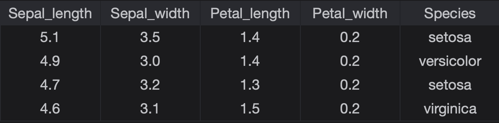
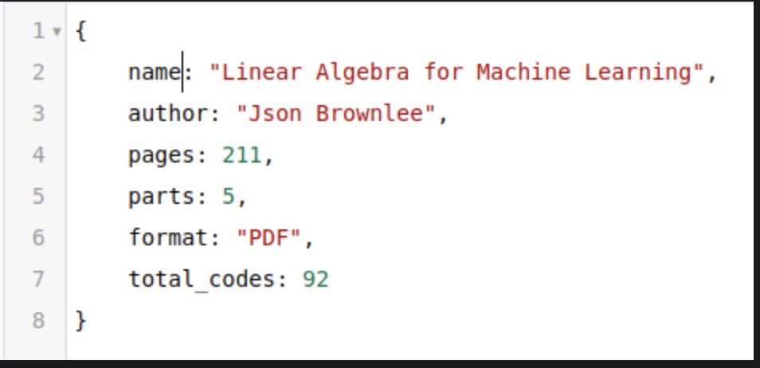
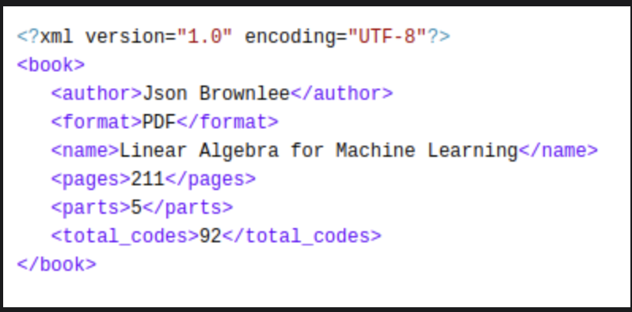

# Structured vs. Semi-Structured vs. Unstructured Data

Uncover details about Structured, Semi-structured, and Unstructured Data.  
 Specifically, Structured Data has a specific format while Unstructured Data lacks it.  
 Semi-structured Data falls in between the two.

## Structured Data

It comes with a predefined format and structure. Structure Data is usually stored in Relational Database.  
 It is easy to deal with in the Data Science domain.

**Example**

- Here's a simple table with columns of diverse types. It can be stored in any Relational Database, Excel file, etc.

## Semi-structured Data

It comes with a predefined format and structure but is not stored in the Relational Database.

**Example**

- JSON (Javascript Object Notation)

- XML (Extensible Markup Language)

## Unstructured Data

It does not have a specific format and lacks structure. It is the type of data that presents many challenges to handle in the Data Science domain.

**Example**

- Image
- Video
- Speech
- Email or any article as seen below
- Any webpage
