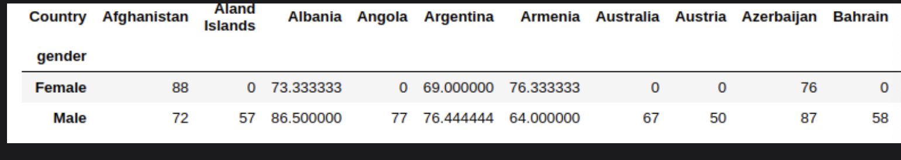

# Pandas

Learn about Pandas and how it is used extensively in the industry.

> We'll cover the following:
>
> - Pandas
> - Pandas data structures
>   - Dataframes
>   - Series
> - Pandas operations
>   - Group by (Split-Apply-Combine)
>   - Merging and concatenating Dataframes
>   - Pivot table
>   - Stack columns

## Pandas

Pandas is a python library that is intended for Data Science use-cases and is used extensively in the field.  
 It provides many useful functionalities to make the day-to-day job of a Data Scientist very easy.

In this lesson, we will be looking into several Jupyter Notebooks, (used for writing and running the code). We will also be working with the most extensively used operations in the industry.

## Pandas data structures

Pandas have data structures that allow us to store and process the data. It also provides several functions and methods to retrieve data out of these structures and analyze it.

#### Dataframes

Pandas Dataframes are 2-dimensional table data structures that allow us to store the Structural Dataset and analyze it.  
 They also have an index label for each row.

#### Series

It is a 1-dimensional array holding elements of any type. It has its own uses and functionalities.

## Pandas operations

#### Group by (split-apply-combine)

Many use cases in the industry involve group by operation. It is used for grouping data that has the value of one or more columns (attributes) of a table.

Typical use cases of the group by operation in the industry include the following:

- Grouping the employees based on their grade and rank.
- Grouping the people of the U.S. based on their region, meaning people belonging to a single state.
- Grouping the people in a country based on their gender, and then calculating some statistics like the average pay of each group.
- Checking to see what the sale across a month in all the previous years.  
   In this case, we will be performing gorup by on months.
- Grouping the players of a club based on their worldwide ranking, and then investing accordingly in their training.

          grouped_data=df.groupby('Country').agg({'salary': lambda salary: salary.sum(), 'weight': lambda weight: weight.median(), 'height': lambda height: height.mean(), 'age': lambda age: age.max()})

#### Merging and concatenating Dataframes

This is also one of the most extensively used operation in the industry. Most of the times we have data dispersed in different sources. We use the functionalities provided by Pandas to consolidate them in one place. Pandas provide different functions for doing so.

- Inner Join: It joins the rows between tables that have the same value of an attribute or column.
- Left Outer Join : It also joins the rows between tables that have the same value of an attribute or column. However, this time, it keeps all of the rows from the left table, and places “NaN” (Not a Number) in the respective missing attributes of the right table.
- Right Outer Join : It also joins the rows between tables that have the same value of an attribute or column. However, this time, it keeps all of the rows from the right table, and places “NaN” in the respective missing attributes of the left table.

        result = pd.merge(students, countries, on="student_id", how="inner")

#### Pivot table

Pivot tables are also one of the most extensively used tables in the industry. They are constructed out of a raw dataset and statistics of a combinations of rows and columns.

The above table shows us the mean weight of both males and females (rows) in each of the countries. The values onside the table are the means of the weights calculated across the given sample of countries.

        table = pd.pivot_table(df, values='weight', index=['gender'], columns=['Country'], aggfunc=np.mean, fill_value=0)

#### Stack columns

It converts the prescribed levels of columns of indexes.
