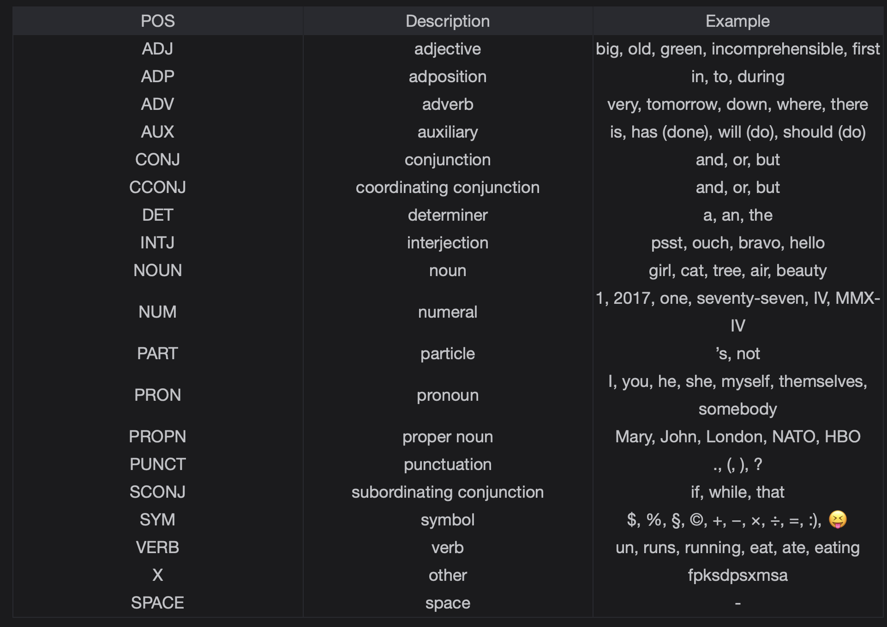

# Spacy Part 1

Spacy is a library for Natural Language Processing and is used extensively in the industry for text processing.

> We'll cover the following:
>
> - Spacy
> - Tokenization
> - Sentence Tokenization
> - Stop words removal
> - Lemmetization
> - Parts of Speech tagging

## Spacy

Spacy is a library used extensively in the industry for text processing. It contains the implementation of state-of-the-art algorithms in the Natural Programming Processing field.  
 Many Natural Language Systems have been deployed using this library's functionalities.

Without getting into too much detail, we will be looking into the bells and whistles of this library and perform basic functionalities of text processing like:

- Tokenization
- Parts of speech tagging
- Named entity recognition
- Dependency parsing

## Tokenization

Tokenization refers to splitting the text into its tokens (words). Splitting is usually done on white space but there can be other delimeters.  
 Spacy also provides a built-in function to tokenize a given piece of text.

## Sentence Tokenization

Sentence Tokenization is the same as tokenization.  
 However, this time, instead of words we are tokenizing a document on each sentence.

## Stop words removal

The words that are most commonly used in Englist like "the" or "of" etc are stop words.  
 Sometimes, they need to be removed in text processing in most used cases.

## Lemmetization

Look at the definition of Lemmatization form Cambridge Dictionary.  
 _Lemmatization is the process of grouping inflected forms together as a single base form._

Im simple words, it is about taking a word to its base form using the technique of Natural Language Processing under the hood.

---

Quantum computing is the use of quantum-mechanical phenomena to perform computation, such as superposition and entanglement.  
 A quantum computer is used to perform such computation, which can be implemented theoretically or physically.

---

## Parts of Speech tagging

Parts of speech show us how a word functions in its meaning and how it grammatically functions in a sentence.  
 There are eight parts of speech in the English language. The Spacy module gives us the following universal parts of speech as can be seen in the table.

