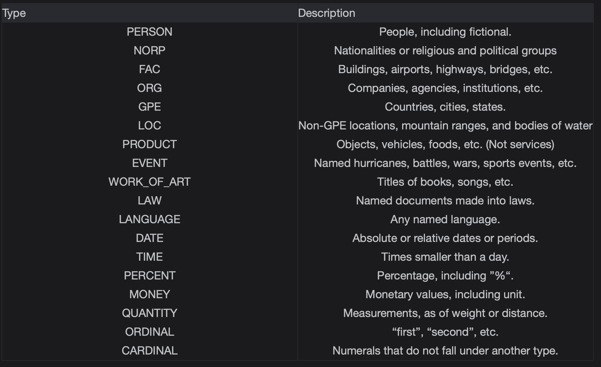
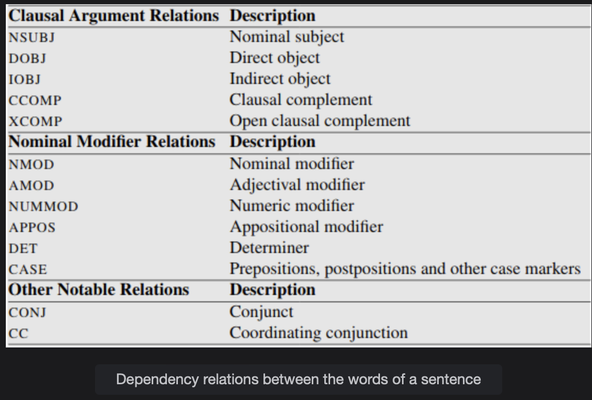

# Spacy Part 2

Learn more details about Spacy in this lesson.

> We'll cover the following:
>
> - Named Entity Recognition
> - Dependency parsing

## Named Entity Recognition

DEF:  
 _Named Entity Recognition (NER), also known as entity identification, entity chunking, and entity extraction is a subtask of information extraction that seeks to locate and classify a named entity mentioned in unstructured text into pre-defined categories. These categories could include things like person names, organizations, locations, medical codes, time expressions, quntities, monetary values, percentages, etc._

Spacy provides the following named entities.

## Dependency parsing

Dependency Parsing is the process of assigning a syntactic structure to a sentence. It gives us the relationship between different words of a sentence and marks the head and the dependent word in a sentence.

It is mostly used in Speech processing and Natural Language Processing tasks to enable the computer to make sense of the structure of the sentence.

**EG: I prefer the morning flight through Denver.**

The table below gives us the dependency relations which can exist between the words of a sentence. It has been taken from the famous book by Jurafsky.

