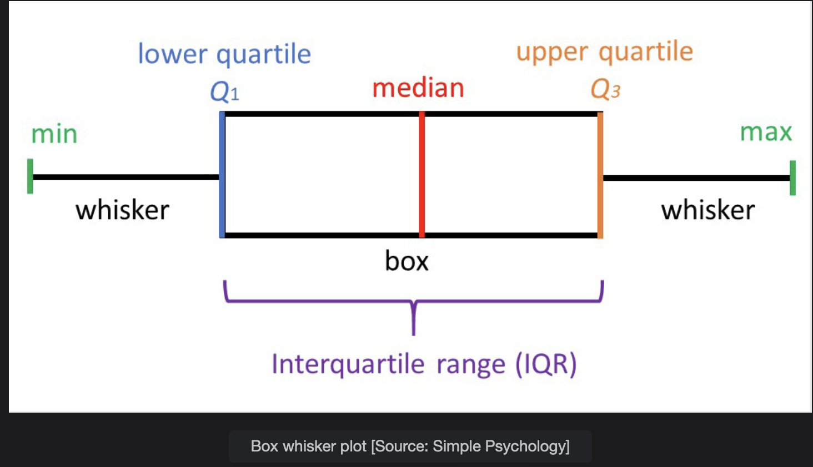

# Seaborn

Seaborn is a library used extensively for data visualizations in Data Science.

> We'll cover the following:
>
> - Seaborn
> - Scatter plot
> - Correlation
> - Bar chart
> - Histogram
> - Line plot
> - Box plot

## Seaborn

We will be looking into how Seaborn is used for different types of visualizations in Data Science.  
 It is based on Matplotlib which is also a famous visualization library used for famous statistical graphs.  
 Furthermore, we will look into different code snippets to show different visualization types.

## Scatter plot

The scatter plot is one of the most widely used plots in the industry, and it is used to study the **relationship between two numeric variables**. It plots the two variables on the Cartesian plane. Values of one variable are on the x-axis and values of the other variable are on the y-axis.

## Correlation

Also used a lot in the Industry, correlation gives us the **measure of the linear relationship between two variables and how much impact on one variable will cause a change in the other variable.**  
 It has a value between -1 and 1, which can be inferred as below.

- The closer the value is to 1, there is a positive correlation between two variables, meaning an increase in one variable causes an increase in the other variable and vice versa.
- The closer the value is to -1, there is a negative correlation between the two variables, meaning an increase in one variable causes a decrease in the other variable and vice versa.
- The value close to 0 depicts that there is no relationship between the two variables.

## Bar chart

Bar chart is used to show the **relationship between one numeric and other categorical variables.** One can think of categorical variables as having categories.  
 The Bar chart can be drawn vertically or horizontally. On the x-axis we have the categorical variable values. On the y-axis, we have the numeric values in a vertical version of the Bar chart and vice versa.

## Histogram

Histogram are often confused with Bar chart.

A histogram is meant to display the **frequency of values in a given variable.** In the case of histogram, on the x-axis, we have the numeric values or bins of values in which a variable’s most frequent values occur. On the y-axis, we have the range of frequencies in which the values occur.

## Line plot

Line plots are most commonly used to see the **trend in the variable chronologically over time.** They are mostly used in Time Series Analysis.

It is most likely the Scatter plot except the values are sorted chronologically on the x-axis and are joined by line segments.

## Box plot

Box plot are used to know how the values in a variable are spread out. They also show us the skewness in the variable and can also be used to catch the outliers (data points depicting unusual behaviour) in the dataset.

---

- Min: gives us the minimum value in the variable excluding the outliers, which are below the minimum.
- Max: gives us the maximum value in the variable excluding the outliers, which are above the maximum.
- Median: Median is a value which the divides the variable value into 2 sets. Half of the values are lower than median and half of the value are greater than or equal to Median.
- Lower Quartile: the Lower Quartile is the value below which we have 25% of the values.
- Upper Quartile: the upper quartile is the value below which we hae 75% of the values.
- Interquartile range: It is the difference between the upper and the lower quartile and gives us the spread of the middle 50% of the variable values.
- whiskers: they represent the lower and upper 25% of the values on the line.
