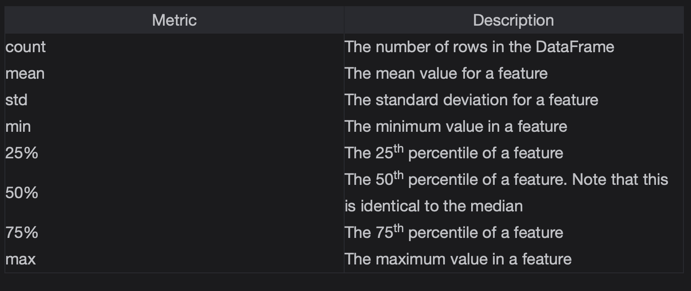

# Metrics

Use pandas to obtain statistical metrics for data.

> We'll cover the following:
>
> - Chapter Goals:
> - A. Numeric metrics
> - B. Categorical features

## Chapter Goals:

- Understand the common metrics used to summarize numeric data
- Learn how to describe categorical data using histograms

## A. Numeric metrics

When working with numeric features, we usually want to calculate metrics such as mean, standard deviation, etc.  
 These metrics give us more insight into the type of data we're working with, which benefits our overall analysis of the dataset.

Rather than calculating several different metrics separately, **pandas provides the describe function to obtain a summary of a DataFrame's numeric data.**

The metrics included in the output summary of describe are

        # df is predefined
        print('{}\n'.format(df))

        metrics1 = df.describe()
        print('{}\n'.format(metrics1))

        hr_rbi = df[['HR','RBI']]
        metrics2 = hr_rbi.describe()
        print('{}\n'.format(metrics2))

        ---
            playerID  yearID teamID  HR  RBI
        0   cruzne02    2017    SEA  39  119
        1  pedrodu01    2017    BOS   7   62
        2   cruzne02    2016    SEA  43  105
        3  pedrodu01    2015    BOS  12   42
        4  troutmi01    2017    LAA  33   72
        5  pedrodu01    2016    BOS  15   74

                    yearID         HR         RBI
        count     6.000000   6.000000    6.000000
        mean   2016.333333  24.833333   79.000000
        std       0.816497  15.341664   28.312541
        min    2015.000000   7.000000   42.000000
        25%    2016.000000  12.750000   64.500000
        50%    2016.500000  24.000000   73.000000
        75%    2017.000000  37.500000   97.250000
        max    2017.000000  43.000000  119.000000

                    HR         RBI
        count   6.000000    6.000000
        mean   24.833333   79.000000
        std    15.341664   28.312541
        min     7.000000   42.000000
        25%    12.750000   64.500000
        50%    24.000000   73.000000
        75%    37.500000   97.250000
        max    43.000000  119.000000
        ---

> Using describe with a DataFrame will return a summary of metrics for each of the DataFrame's numeric features.  
>  In our example, df had three features with numerical values: yearID, HR, and RBI.
>
> Since we normally treat yearID as a categorical feature, the second time we used describe was with the hr_rbi DataFrame, which only included the HR and RBI features.

To have describe return specific percentiles, we can use the percentiles keyword argument.  
 **The percentiles argument takes in a list of decimal percentages, representing the percentiles we want returned in the summary.**

        metrics1 = hr_rbi.describe(percentiles=[.5])
        print('{}\n'.format(metrics1))

        metrics2 = hr_rbi.describe(percentiles=[.1])
        print('{}\n'.format(metrics2))

        metrics3 = hr_rbi.describe(percentiles=[.2,.8])
        print('{}\n'.format(metrics3))

        ---
                    HR         RBI
        count   6.000000    6.000000
        mean   24.833333   79.000000
        std    15.341664   28.312541
        min     7.000000   42.000000
        50%    24.000000   73.000000
        max    43.000000  119.000000

                    HR         RBI
        count   6.000000    6.000000
        mean   24.833333   79.000000
        std    15.341664   28.312541
        min     7.000000   42.000000
        10%     9.500000   52.000000
        50%    24.000000   73.000000
        max    43.000000  119.000000

                    HR         RBI
        count   6.000000    6.000000
        mean   24.833333   79.000000
        std    15.341664   28.312541
        min     7.000000   42.000000
        20%    12.000000   62.000000
        50%    24.000000   73.000000
        80%    39.000000  105.000000
        max    43.000000  119.000000
        ---

Note that the 50th percentile, i.e. the median, is always returned. The values specified in the percentiles list will replace the default 25th and 75th percentiles.

## Categorical features

With categorical features, we don't calculate metrics like mean, standard deviation, etc.  
 **Instead, we use frequency counts to describe a categorical feature.**

The frequency count for a specific category of a feature refers to how many times that category appears in the dataset.  
 In pandas, we **use the value_counts function to obtain the frequency counts for each category in a column feature.**

The code below uses the **value_counts** function to get frequency counts of the 'playerID' feature.

        p_ids = df['playerID']
        print('{}\n'.format(p_ids.value_counts()))

        print('{}\n'.format(p_ids.value_counts(normalize=True)))

        print('{}\n'.format(p_ids.value_counts(ascending=True)))

        ---
        pedrodu01    3
        cruzne02     2
        troutmi01    1
        Name: playerID, dtype: int64

        pedrodu01    0.500000
        cruzne02     0.333333
        troutmi01    0.166667
        Name: playerID, dtype: float64

        troutmi01    1
        cruzne02     2
        pedrodu01    3
        Name: playerID, dtype: int64
        ---

Using value_counts without any keyword arguments will return the frequency counts for each category, sorted in descending order.

Setting **normalize=True returns the frequency proportions, rather than counts,** for each category (note that the sum of all the proportions is 1).  
 We can also set ascending=True to get the frequencies sorted in ascending order.

If we just **want the names of each unique category in a column, rather than the frequencies,** we use the unique function.

        unique_players = df['playerID'].unique()
        print('{}\n'.format(repr(unique_players)))

        unique_teams = df['teamID'].unique()
        print('{}\n'.format(repr(unique_teams)))

        ---
        array(['cruzne02', 'pedrodu01', 'troutmi01'], dtype=object)

        array(['SEA', 'BOS', 'LAA'], dtype=object)
        ---

So far we've focused on categorical features with string values.  
However, categorical features can also have integer values.  
 For example, we can use yearID as a categorical feature with each unique year as a separate category.

        y_ids = df['yearID']
        print('{}\n'.format(y_ids))

        print('{}\n'.format(repr(y_ids.unique())))
        print('{}\n'.format(y_ids.value_counts()))

        ---
        0    2017
        1    2017
        2    2016
        3    2015
        4    2017
        5    2016
        Name: yearID, dtype: int64

        array([2017, 2016, 2015])

        2017    3
        2016    2
        2015    1
        Name: yearID, dtype: int64
        ---
