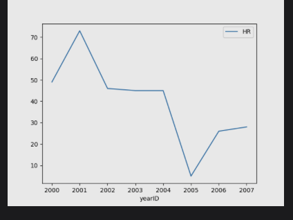
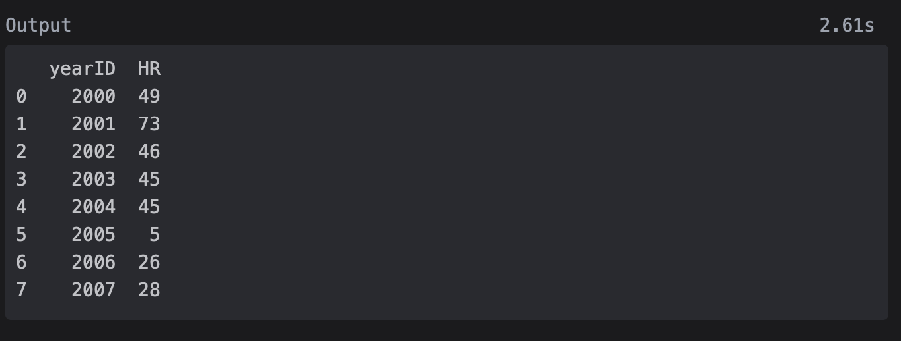

# Plotting

Learn how to plot DataFrames using the pyplot API from Matplotlib.

> We'll cover the following:
>
> - Chapter Goals:
> - A. Basics
> - B. Other plots
> - C. Multiple features

## Chapter Goals:

- Learn how to plot DataFrame using the pyplot API

## A. Basics

The main function used for plotting DataFrames is [plot](https://pandas.pydata.org/pandas-docs/stable/reference/api/pandas.DataFrame.plot.html).  
 This function is used in tandem with the [show](https://matplotlib.org/stable/plot_types/index.html) function from the pyplot API, to produce plot visualization.

We import the pyplot API with the line:  
 import matplotlib.pyplot as plt

        # predefined df
        print('{}\n'.format(df))

        df.plot(kind='line',x='yearID',y='HR')
        plt.show()

  

After calling df.plot, which creates our line plot, we then use plt.show to open a separate window containing the visualization of the plot.  
 You can also use **plt.savefig** to save the plot to a PNG or PDF file.

        # predefined df
        print('{}\n'.format(df))

        df.plot(kind='line',x='yearID',y='HR')
        plt.show()
        plt.savefig('output/legend.png')  # save to PNG file

The plot we created has no title or y-axis label.  
 We can manually set the plot's title and axis labels using the pyplot API.

        # predefined df
        print('{}\n'.format(df))

        df.plot(kind='line',x='yearID',y='HR')
        plt.title('HR vs. Year')
        plt.xlabel('Year')
        plt.ylabel('HR Count')
        plt.show()

We use the [title](https://matplotlib.org/stable/api/_as_gen/matplotlib.pyplot.title.html) function to set the title of our plot, and the [xlabel](https://matplotlib.org/stable/api/_as_gen/matplotlib.pyplot.xlabel.html) and [ylabel](https://matplotlib.org/stable/api/_as_gen/matplotlib.pyplot.ylabel.html) functions to set the axis labels.

## B. Other plots

In addition to basic line plots, we can create other plots like histograms or boxplots by setting the kind keyword argument in plot.

        # predefined df
        print('{}\n'.format(df))

        df.plot(kind='bar',y='HR')
        plt.ylabel('Frequency')
        plt.show()
        ----
        ----
        # predefined df
        print('{}\n'.format(df))

        df.plot(kind='box',y='HR')
        plt.show()

There are numerous different kinds of plots we can create by setting the kind keyword argument.  
 A list of the accepted values for kind can be found in the documentation for plot.

## C. Multiple features

We can also plot multiple features on the same graph.  
 This can be extremely useful when we want visualization to compare different features.

        # predefined df
        print('{}\n'.format(df))

        # gca stands for 'get current axis'
        ax = plt.gca()

        df.plot(kind='line',x='yearID',y='H',ax=ax)
        df.plot(kind='line',x='yearID',y='BB', color='red', ax=ax)
        plt.show()

        # predefined df
        print('{}\n'.format(df))

        df.plot(kind='box')
        plt.show()

These are a line plot and boxplot showing both hits(H) and walks(BB).  
 Note that the circles in the boxplots represent outlier values.
