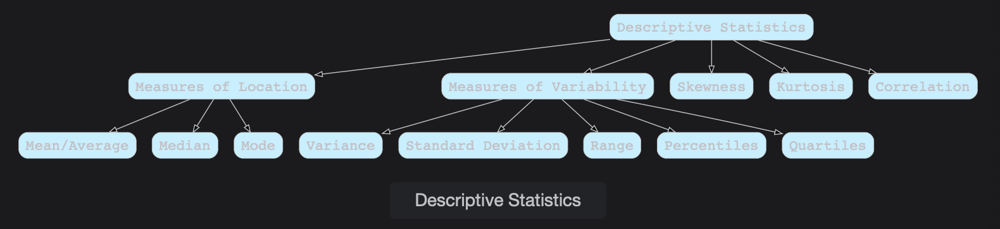

# Statistics

Learn about statistics in this lesson. Statistics deals with studying methods for collecting, analyzing, and describing data.

> We'll cover the following:
>
> - Statistics
> - Types of statistics
>   - Descriptive statistics
>     - Elements of descriptive statistics
>   - Inferential statistics
>     - Sample
>     - Population
>     - Hypothesis testing
>     - Confidence Interval
>     - Regression analysis

## Statistics

**Statistics is a form of mathematical analysis** that uses different tools on a given data set to **describe and make an inference out of it.**

## Types of statistics

Statistics is further divided into two branches: **Descriptive** and **Inferential**

### Descriptive statistics

Descriptive statistics deals with summarizing and describing the data at hand.  
Descriptivr statistics comes up with th following things to make sense out of the data.

##### Elements of descriptive statistics

> - Descriptive statistics
>   - Measures of Location
>     - Mean/Average
>     - Median
>     - Mode
>   - Measures of Variability
>     - Variance
>     - Standard Deviation
>     - Range
>     - Percentile
>     - Quartiles
>   - Skewness
>   - Kurtosis
>   - Correlation

### Inferential statistics

Inferential statistics involves drawing the right conclusion from the Statistical analysis which was performed using the Descriptive Statistics.  
 It draws the inference from the dataset about a general population.

It is also used extensively in the field of Data Science. We deal with the below mentioned concepts in inferential statistics.

##### Sample

A sample consists of elements or individuals drawn from a population using some procedure.

##### Population

Population consists of similar elements or individuals which are interest for a particular experiment or result.

##### Hypothesis Testing

It involves using sample data to answer some questions regarding to the population. These questions can be:

- Inferring the mean of the population using the sample.
- Does one population have the same or different mean from the other population?

##### Confidence Interval

In inferential statistics we estimate the population parameters like mean and standard deviation using the sample.  
Confidence intervals are meant to create a range of values in which the population parameter is likely to fall.

##### Regression analysis

It is one of the most extensively used concepts in Data Science.  
In regression analysis, we build a relationship between independent variables and the dependent variable.  
 This makes use of the previous hypothesis testing to determine whether the relationship determined from sample also exists in the population or not.
