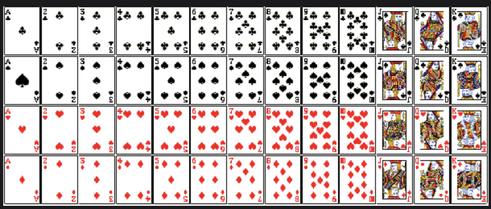

# Joint Probablity

In this lesson, learn about joint probablity with the help of some examples.

> We'll cover the following:
>
> - Random variable
>   - Example 1
>   - Example 2
> - Joint probablity
>   - Probablity for independent events
>     - Example
>     - Solution
>   - Probablity for Mutually exclusive events
>     - Example
>   - Probablity for Non Mutually Exclusive Events
>     - Example
>     - Solution

## Random variable

A random variable is a function that assigns a real number to each value in the sample space.  
 This is produces as a result of a random experiment like tossing a coin or throwing a dice.

#### Example 1

When we flip a coin twice, there are four possible outcome: both heads, heads and tails, tails and heads, or both tails.  
 The value of x below represents the number of heads from each outcome of these four outcomes:  
 Sample space | x  
 HH | 2  
 HT | 1  
 TH | 1  
 TT | 0

#### Example 2

Random variable Y represents the number of times we roll "5" when rolling a six-sided dice six times.  
 Therefore, the possible values of this random variable Y, can be anything from 0 (we never roll "5") to 6 (we roll "5" every time).

## Joint probablity

This refers to the Probablity of two or more simultaneous events and is used at many places in the Data Science field, especially when dealing with textual data where we have to find the probablity of words which can occur together.

The joint probablity of two events is denoted as below:  
 P(A and B) = P (A intersection B)  
 Where P(A) and P(B) are probablities of events A and B respectively.

#### Probablity for independent events

If one event is not dependent on the other, the events are said to be independent and their joint probablity is calculated as below:  
 P(A and B) = P(A, B) = P(A intersection B) = P(A) \* P(B)  
 Where P(A) and P(B) are probablities of events A and B respectively.

###### Example

A jar contains three red, five green, two blue, and six yellow marbles. A marble is chosen from the jar at random. After replacing it, a second marble is chosen. What is probablity of choosing a green and then a yellow marble?

###### Solution

From the above question, we can deduce the below things from the above question.

- Number of red marbles = 3
- Number of green marbles = 5
- Number of blue marbles = 2
- Number of yellow marbles = 6
- Total marbles = 16
- Let A be the event that the green marble is drawn
- Let B be the event that the yellow marble is drawn
- Let C be the event that the blue marble is drawn
- Let D be the event that the red marble is drawn
- As the event of drawing marble is independent from each other we can proceed as follows:  
   P(A) = 5 / 16  
   P(B) = 6 / 16  
   P(A and B) = P(A intersection B) = (5/16) \* (6/16) = 15/128

#### Probablity for Mutually exclusive events

Mutually Exclusive events are those events which cannot occur at the same time. For example, when we toss a coin, the output is either Head or Tail.

- If the two events are mutually exclusive, then the probablity of both occurring is:  
   P(A and B) = P(A intersection B) = 0
- If the two events are mutually exclusive, then the probablity of either occurring is:
  P(A or B) = P(A union B) = P(A) + P(B) - P(A intersection B) = P(A) + P(B) - 0 = P(A) + P(B)  
  Where P(A) and P(B) are probablities of events A and B respectively.

> A standard deck of 52 cards plus 2 joker cards consist of the below cards.
>
> 
>
> - There are four suits Spades, Diamonds, Hearts, and Clubs.
> - There are thirteen suits of each card.
> - In each suit there are nine numbers from 2 to 10, a Jack, a Queen, a King, and an Ace.
> - There are a total of 9 \* 4 = 36 number cards, four Jacks, four Queens, four Kings, and four Ace cards.

###### Example

- There are four Queens in 52 deck cards, so the probablity of a card being Queen is P(Queen) = 4 / 52 = 1 / 13
- There are four Jacks in 52 deck cards, so the probablity of a card being Jack is P(Jack) = 4 / 52 = 1 / 13
- Combining the above two probablities meaning the probablity of drawing a Queen or Jack is P(Queen) + P(Jack) = (1 / 13) + (1 / 13) = 2 / 13

#### Probablity for Non-Mutually exclusive events

If the events are not mutually exclusive, their joint probablity is calculates as:

    P(A or B) = P(A union B) = P(A) + P(B) - P(A intersection B)

Where P(A) and P(B) are probablities of events, A and B respectively.ss

###### Example

John is going to graduate from an industrial engineering department in a university by the end of the semester. After being interviewed at two companies he likes, he assessed that his probablity of getting an offer from company A is 0.8, and his probablities of getting an offer from company B is 0.6.  
 If he believes that the probablity that he will get offers from both companies is 0.5, what is the probablity that he will get at least on offer from these two companies?

###### Solution

From the above question, we can deduce the following:

- The probablities for getting an offer from company A is 0.8, or P(A) = 0.8.
- The probablities for getting an offer from company B is 0.6, or P(B) = 0.6.
- The probablity of getting offers from both companies A and B is 0.5, or P(A intersection B) = 0.5.
- The probablity for at least one offer from these companies, or P(A union B) = ?.

Using the above formula we have:

P(A or B) = P(A union B) = P(A) + P(B) - P(A intersection B) = 0.8 + 0.6 - 0.5 = 0.9.
