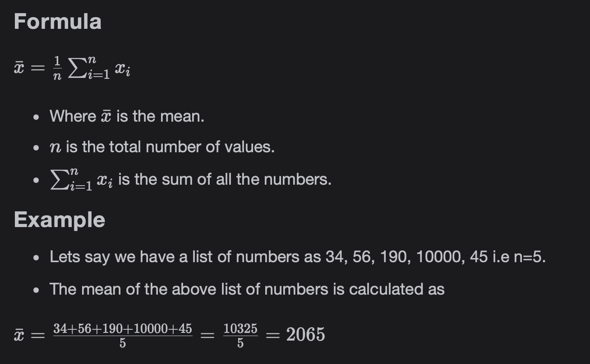

# Measures of Locations

Discuss measures of locations.

> We'll cover the following:
>
> - What is Descriptive Statistics?
> - Measures of Location or Central Tendency
>   - Mean
>   - Median
>   - Mode
>   - Mean Vs. median

## What is Descriptive Statistics?

Descriptove Statistics provide us with quantitative statistics about data.  
 It helps us show and summarize the data in a meaningful way so that patterns start emerging out of it.

## Measures of Location or Central Tendency

Measure of Location also referred to as Measures of Central Tendency help us to summarize a list of numbers. The three most commonly used measures of Location are mean, median, and mode.

#### Mean

Mean is one of the measures of Location and is used extensively in the field. It is calculated by adding up all the values of the dataset and dividing them by the total number of values.  
 Mean is also referred to as expected value.

One common way it is used in the field is by replacing the missing values in a column with mean of the values present in the data.

#### Median

Median is the value that divides the dataset into two parts i.e. 50% of the values of the dataset are below it and 50% of the values of the dataset are above it.  
 It has a pre-condition. That is, that the dataset should be sorted (ascending or descending).

- Case 1: When the number of values is odd. The Median is the middle value of the sorted list.  
   Example:
  - Lets say we have a list of numbers as 34, 56, 190, 10000, 45, so n = 5.
  - Sorting the above list in ascending order.
  - The Median is 56.
- Case 2: When the number of values is even. The Median is calculated by adding the middle two values of the list and dividing them by 2. It is the mean of n/2 and n/2 + 1 values of the list where n in the total number of values in the list.  
   Example:
  - Let's say we have a list of numbers 34, 56, 190, 10000, 45, 327.
  - Sorting the above list in ascending order.
  - The Median of the above list of numbers is calculated as below.  
    n/2 value = 56
    n/2 + 1 value = 190  
    Median = (56+190) / 2 = 123

#### Mode

Mode is the value that appears often in the dataset. A list can have more than one mode. It a dataset is having two values which occur most it is called **bimodal.**  
 If it has more than two mode values, it is called **multi-modal.**

#### Mean Vs. median

**Mean -** Mean is affected by the presence of large values or outliers in the dataset and is mostly used for Normal or Gaussian Distribution.

**Medain -** Median is not affected by the presence of large values or outliers in the dataset and is mostly Skewed distributions.
