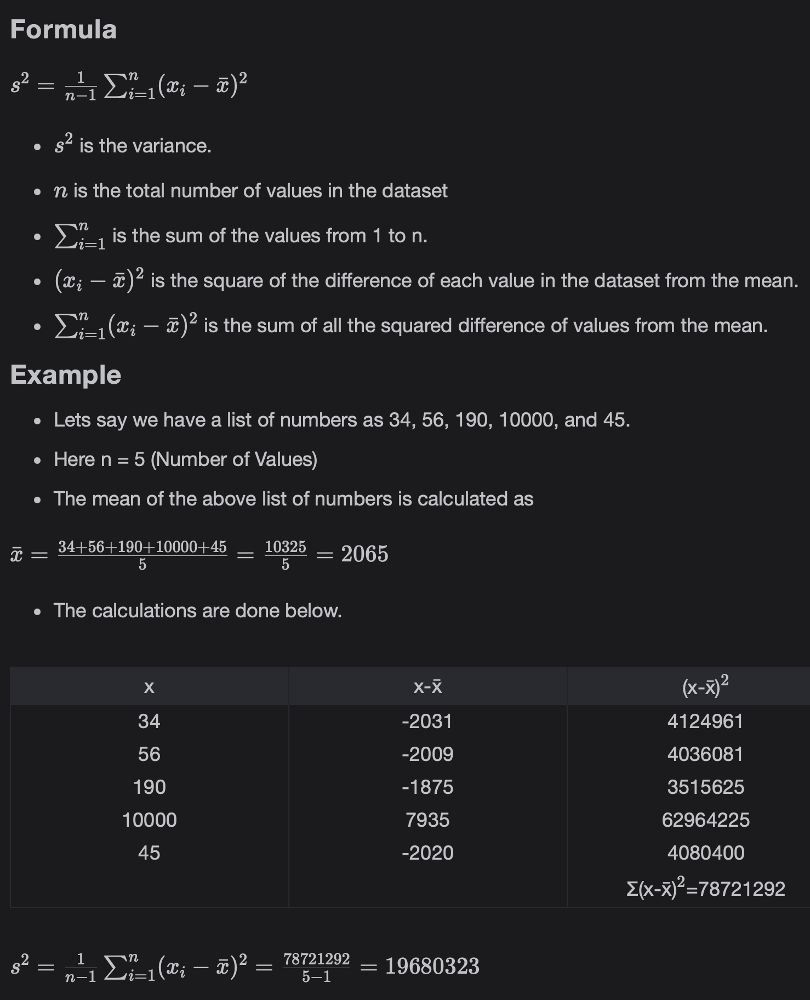
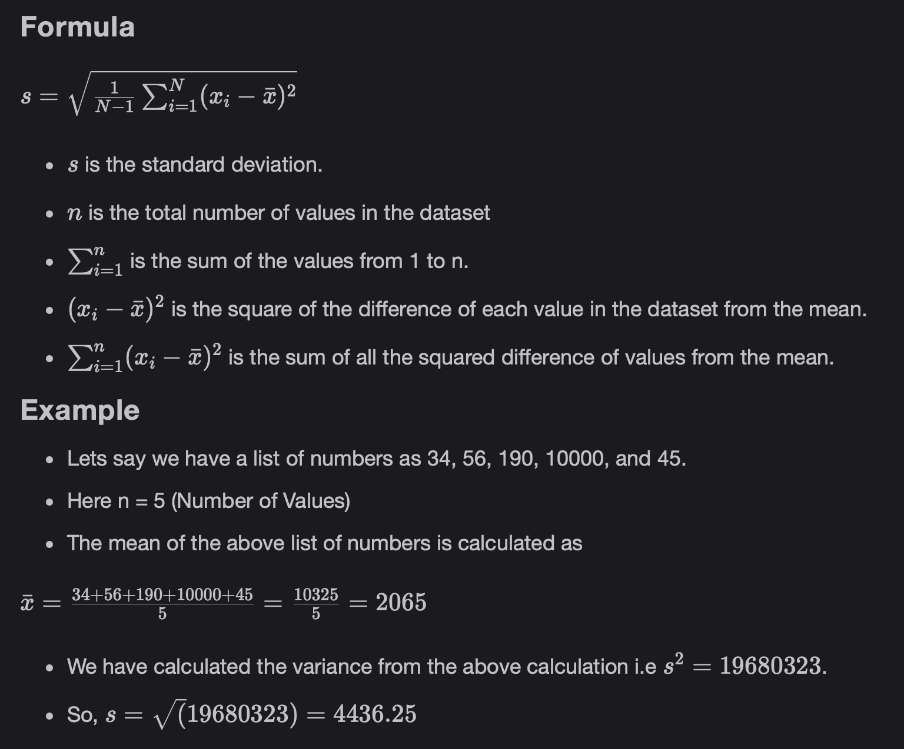
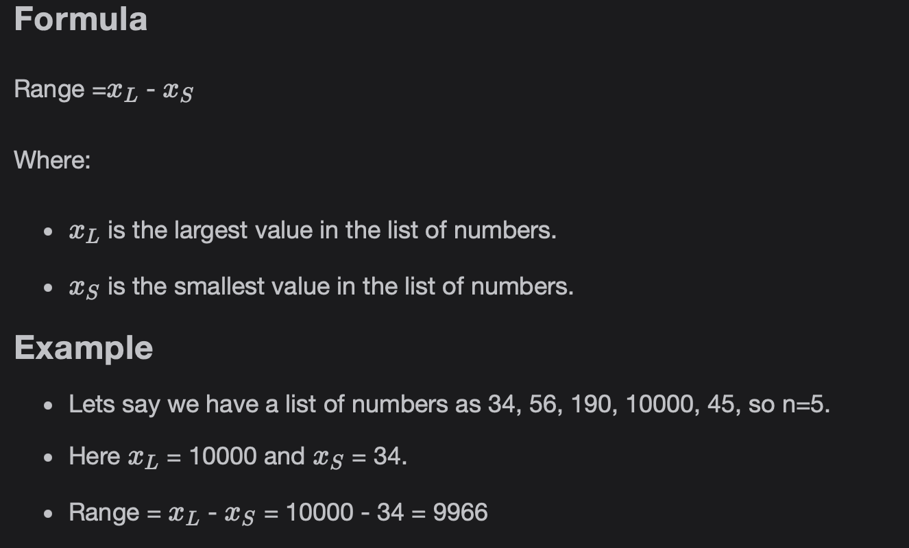
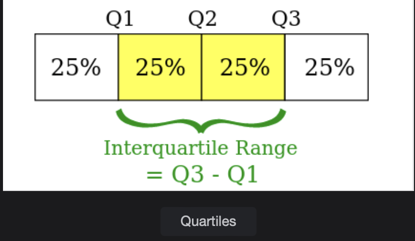

# Measures of Variability

Learn about measures of Variability which gives us the dispersion in the dataset.

> We'll cover the following:
>
> - Measures of Variability or Spread
>   - Variance
>   - Standard Deviation
>   - Range
>   - Quartiles
>   - Percentiles
>   - Five-Number summary

## Measures of Variability or Spread

Measure of Variability also known as the measure of spread shows us **the dispersion in the dataset and how the data is distributed around the center** (Measure of Location) of the dataset.  
 The most commonly used Measures of Variability are discussed below.

### Variance

The Variance is the expected value (mean) of the squared differences of the data values from the mean. It shows us how close or far the values in a dataset are from the mean of the dataset in squared units.

### Standard Deviation

Standard deviation is calculated by taking the square root of the variance. It gives us the same measure but in simplified form, and the units are not squared anymore.  
 This makes the inference clearer.

### Range

Range is defined as the difference between the largest and the smallest values in the dataset. It gives us an idea about the range of dataset values.

### Quartiles

Quartiles are numbers that divide the data values into quarters. They break the dataset into four segments.  
 Like for median they also have a pre-condition that the data should be sorted.

- Q1 is the lower quartile.
- Q2 is the middle quartile. It is the median.
- Q3 is the upper quartile.
- Q3 - Q1 is called the **inter-quartile range**.

### Percentile

Percentiles are the values below which a percentage of values fall. They are used extensively along with Quartiles in the Data Science field.

**Formula:**

- First we sort the dataset in ascending order.
- x1 and xn are the smallest and the largest values of the dataset.
- n is the total number of values in the dataset.
- xi is the pi percentile of the data where
- pi = 100 \* (i-0.5)/n

### Five-Number Summary

Five-Number summary is also used to describe a set of data. It indicated following five parameters:

1. Minimum Value in the dataset
2. Maximum Value in the dataset
3. Median of the dataset
4. Lower Quartile (Q1) of the dataset
5. Upper Quartile (Q2) of the dataset
