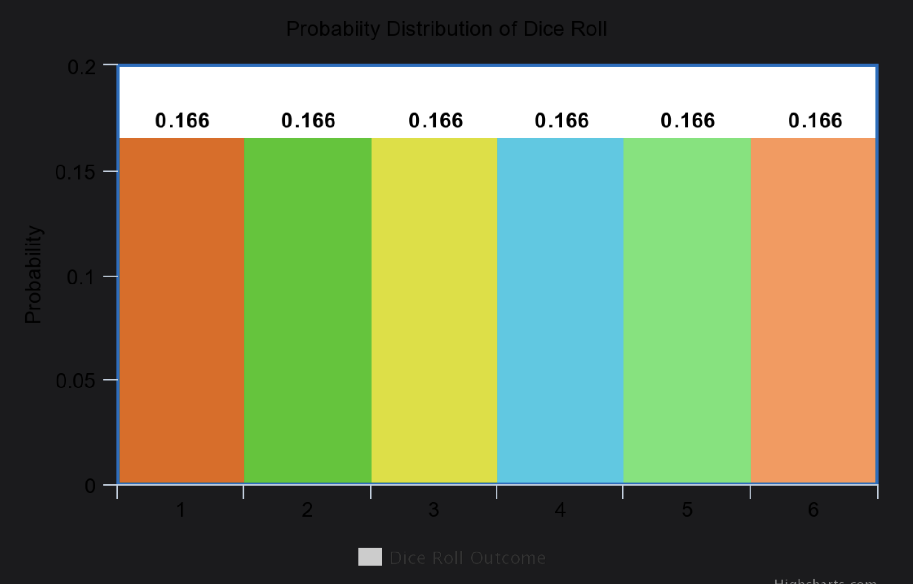
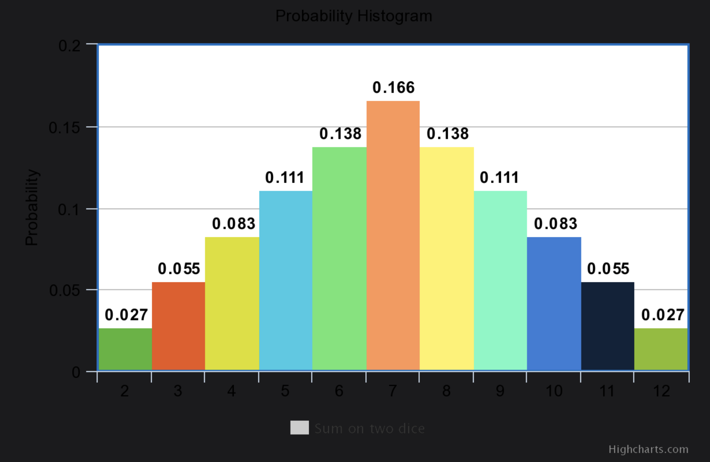
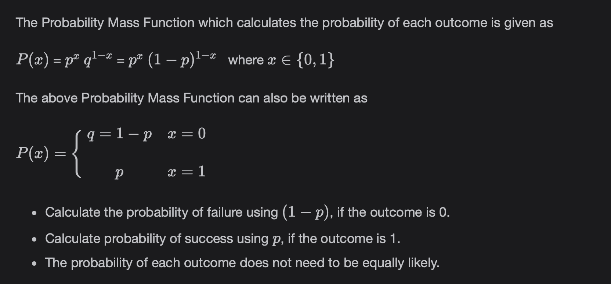
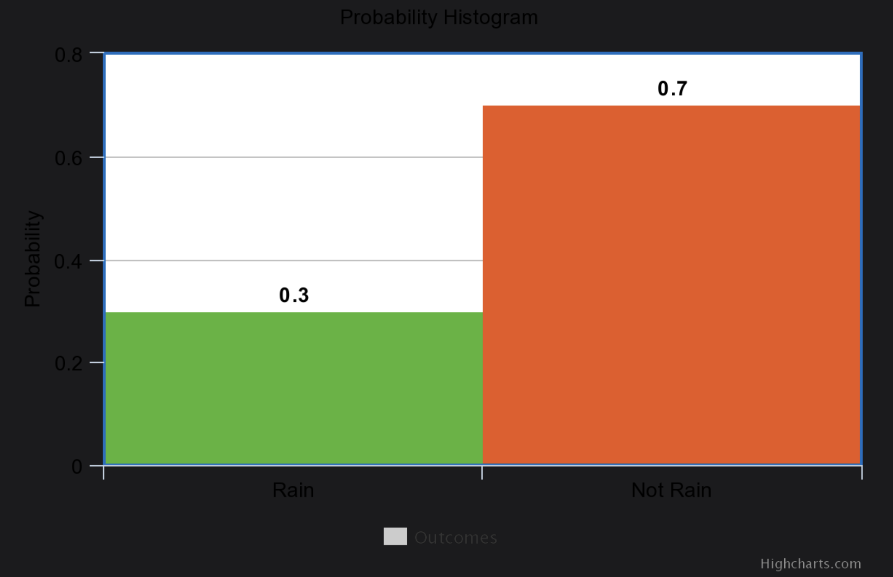
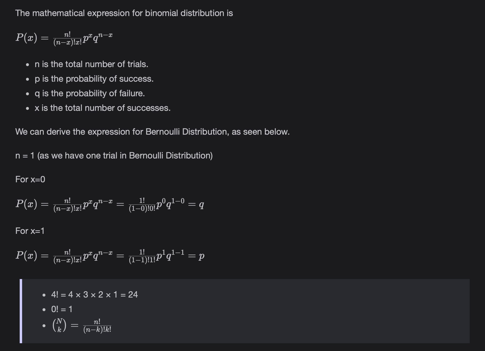

# Probability Distributions (Binomial and Bernoulli Distributions)

Knowledge of Probability Distributions is essential in the Data Science field and it is the backbone for understanding many concepts. You'll learn about it in this lesson.

> We'll cover the following
>
> - What are probability distributions ?
>   - Example
>     - Probability Histogram
> - Types of random variables
>   - Discrete random variables
>   - Example
>     - Probability Histogram
>   - Continuous Random Variables
> - Bernoulli Distribution
>   - Example
> - Binomial Distribution
>   - Example

## What are probability distributions ?

Probability distribution is a summary of probabilities associated with all the possible outcomes of a random variable X.  
 Probability Distributions have a particular shape that has properties like Mean(Expected Value), Variance, Skewness and Kurtosis.

#### Example

When we roll a fair dice, the probability of each outcome is equally likely, meaning 1/6.​

###### Probablity Histogram

If we take the dice roll outcome on the x-axis and its probablity on the y-axis, we get the below graph representation.

## Types of random variables

#### Discrete random variables

Discrete random variables are the variables **whose outcomes take on a discrete set of values.**  
 The function that calculates the probability of each outcome (Probability Distribution) of a Discrete Random Variable is called the **Probability Mass Function.**

###### Example

Let X be the random variable denoting the sum of two dice. When two dice are rolled, the possible outcomes on the face of the dices are (1,1), (1,2), (1,3), (1,4) , (1,5), (1,6), (2,1), (2,2) and so on.  
 So the total outcomes are 36, among which the possible sum on two dices are listed below along with their probability.

###### Probablity Histogram

If we take the sum of the two dice on the x-axis and their probablity on the y-axis, we get the below graph representation.

#### Continuous Random Variables

The variable whose outcomes can take on a real value.  
The **Probability Density Function (PDF) defines the probability distribution of a Continuous Random Variable.**  
 Notice that for Discrete Random Variable it was called Probability Mass Function.

A continuous random variable has a probability of zero of assuming exactly any of its values. Consequently, its probability distribution cannot be given in tabular form.

The **probability distribution of a Continuous Random Variable is shown by a density curve.**  
 The probability that X is between an interval of numbers is the area under the density curve between the interval endpoints.  
 **One of the most commonly used Continuous Probability Distribution is Gaussian or Normal Distribution.**

## Bernoulli Distribution

Bernoulli Distribution is a Discrete Probability Distribution.  
 Bernoulli Distribution consists of only two outcomes: 1 (success) and 0 (failure).

The probability of success is denoted by “p”, and the probability of failure is denoted by “q” or “1-p”.

#### Example

- Weather forecasts say that the probability of rain today is 0.3, so p = 0.3.
- Using this we can calculate the probability that it will not rain today, so q = 1 - p = 1 - 0.3 = 0.7.
- Presenting the probability histogram we have:  
   

## Binomial Distribution

Binomial Distribution is a Discrete Probability Distribution. In Bernoulli Distribution, we analyzed one trial of the experiment whose outcome can be a success or failure.

In Binomial Distribution we have n trials where the outcome of each trial is either a success or a failure. The probability of success for one trial is denoted by “p” and the probability of failure for one trial is denoted by “1-p” or “q”.  
 **Bernoulli Distribution is a Binomial Distribution with n=1 i.e the number of trials in Bernoulli Distribution is 1.**

In Binomial Distribution, the number of trials is fixed.  
Each experimental trial is independent. The probability of success or “p” remains the same in each trial.

#### Example

A coin is tossed ten times. What is the probability of getting exactly six heads?

- Here n = 10
- As it is a fair coin so the probability of head and tail in each toss is equally likely, meaning probability of head = 0.5. So, we deduce that p = 0.5 (probability of success) and q=0.5 (probability of failure).
- Here x = 6. Note that x is the total number of successes.
- Applying the above formula we have: P(x) = 0.2050
- The probablity of getting exactly six heads is 0.2050.
