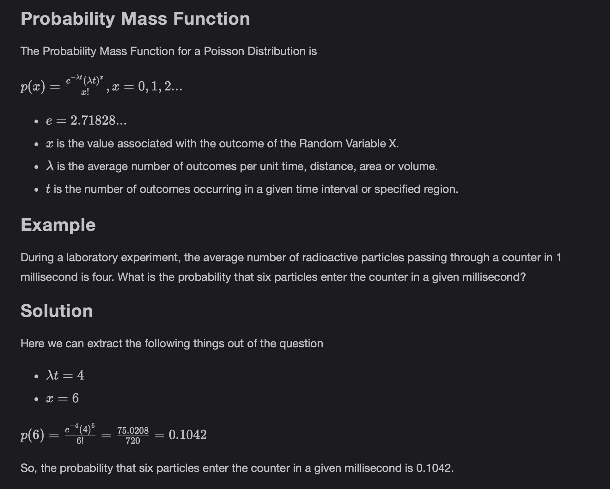

# Poisson Distribution

Learn about Poisson Distribution as knowledge of Probability Distributions is essential in the field of Data Science and it is the backbone for understanding many concepts.

> We'll cover the following
>
> - Poisson Distribution
>   - Properties of Poisson Process
>   - Probability Mass Function
>   - Example
>   - Solution

## Poisson Distribution

Poisson Distribution is a Discrete Probability Distribution. It is associated with the outcomes of experiments which are either success or failure.  
 They occur during a time interval or in a specified region. These experiments are also called Poisson Experiments. Poisson Experiments are derived from the Poisson Process.

#### Properties of Poisson Process

- The Poisson Process has no memory.  
   This means that the number of outcomes occurring in a time interval or region are independent of the number of outcomes occurring in some other time interval.
- The probability that an outcome will occur in a small time interval or small region is proportional to the length of the time interval or the size of the region.
- The probability that more than one outcome will occur in such a short time interval or fall in such a small region is negligible.

## Probablity Mass Function

