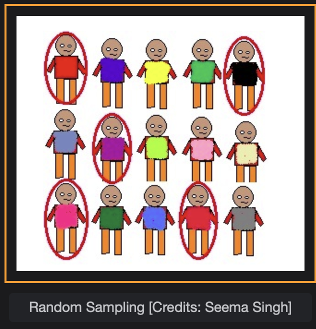
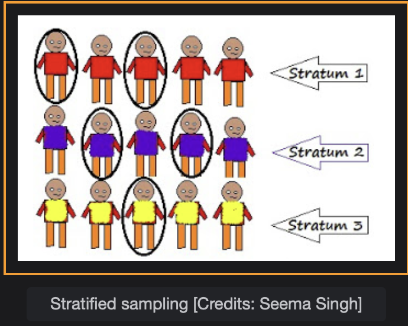

## Sampling Methods

Sampling methods play an important role in sampling the dataset for analysis and modelling and you'll learn about them in this lesson.

> We'll cover the following
>
> - Sampling methods
>   - Random Sampling
>   - Stratified sampling

## Sampling methods

The sampling methods help us to choose a subset of the population in a good manner which helps us to draw inference about the whole population using a sample. It is widely used in Data Science to choose a good representation of the data. Knowledge of the sampling methods is critical in building descriptive and predictive systems. In this lesson, we will be looking at the commonly used sampling methods in detail.

#### Random Sampling

As the name suggests we randomly choose elements for our sample from the population. The sample size is defined at the beginning. Each of the data elements from the population has an equal probability of being selected. Each of the one-hundred sheep, being selected for a sample size of thirty sheep, has an equal probability of
1/100 for being selected.

Random sampling is one of the most simple methods of sampling out there.

> In Machine Learning we divide our dataset at hand into three groups of dataset Training dataset, Validation dataset and Test dataset. In the most simple cases, we go with random sampling depending on the problem to solve, to assign each element of data to each group above.

#### Stratified sampling

Stratified sampling is also one of the most widely used sampling techniques in Machine Learning. There will be more on this in the coming chapters. In stratified sampling, these are the steps involved.

- First the whole population is divided into small sub-groups, called strata. We need to have prior knowledge about the population.
- Sub-grouping is done in such a way that the elements in a sub-group are more similar to each other and the elements in different groups are non-similar to each other.
- At the end, random samples from each strata are chosen.

> In classification problems in machine learning we make sure that samples of each class are almost the same in every split of the dataset for good results. Then, stratified sampling comes into the play.
