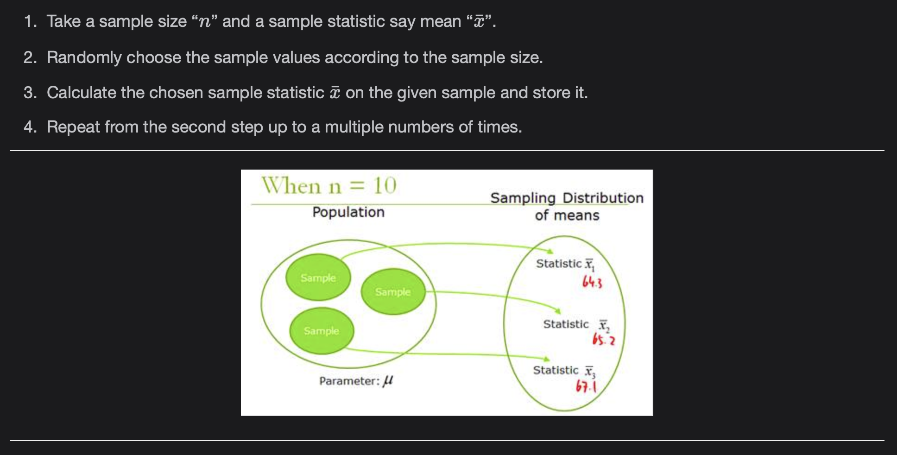
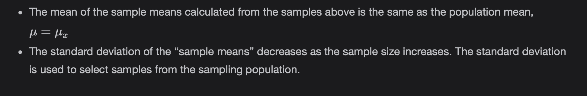

# Key Concepts in Statistics

This lesson describes the key concepts in statistics.

> We'll cover the following
>
> - Key Concepts
>   - Population vs. sample
>   - Statistical Inference
>   - Parameter vs. statistic
>   - Central Limit Theorem
>   - Sampling Distribution
>   - Constructing the sampling distribution
>   - Inference from the Sampling distribution.
>   - Conclusion

## Key Concepts

### Population vs. sample

The population is a collection of all the observations related to the problem at hand.  
 It is not practical to gather knowledge about all the observations. So, we choose a good amount of observations, from the population, which represent our sample.

### Statistical Inference

The process of estimating a population parameter from a sample statistic is called statistical inference. It has two major areas estimation and statistical hypothesis testing.

### Parameter vs. statistic

Values like mean and standard deviation for the population are called parameters while the samples are called statistics.  
 We can estimate the parameter value using the statistic value. The gap between the sample statistic and population parameter is called the sampling error.

### Central Limit Theorem

The Central Limit Theorem states that if you have a large population with mean μ and standard deviation σ and it takes sufficiently large random samples from the population with replacement (samples drawn are independent), then the distribution of the sample means will be approximately normally distributed.

### Sampling Distribution

The probability distribution of a statistic is called a sampling distribution.  
 It depends on the distribution of the population, the size of the samples, and the method of choosing the samples.  
 The standard deviation of the sampling distribution is called the standard error.  
 The standard error of the sampling distribution decreases as the sample size increases.

### Constructing the sampling distribution

### Inference from the Sampling distribution

### Conclusion

