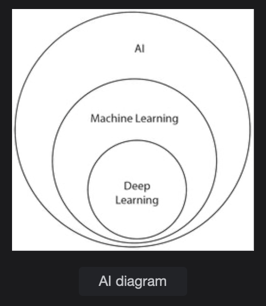
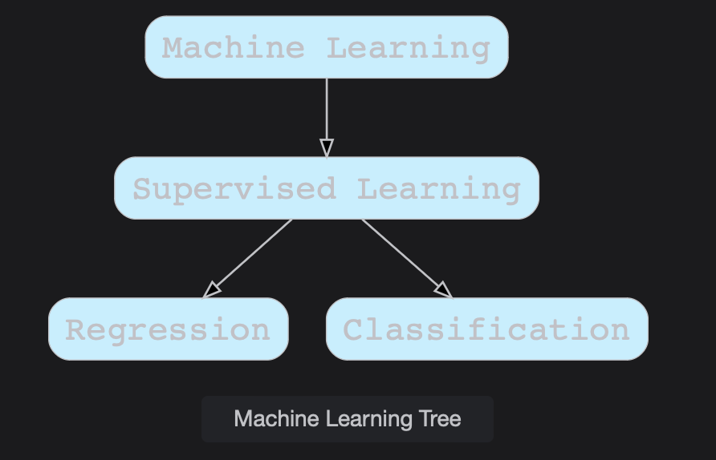
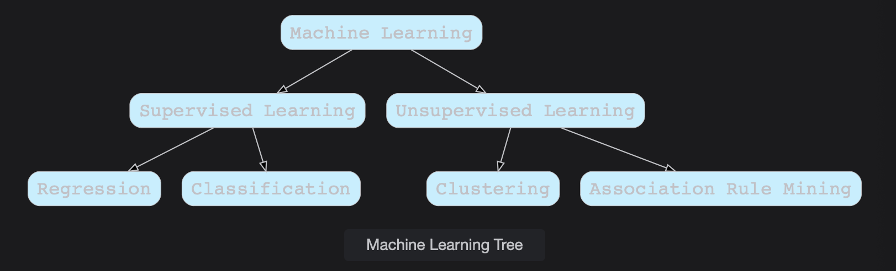
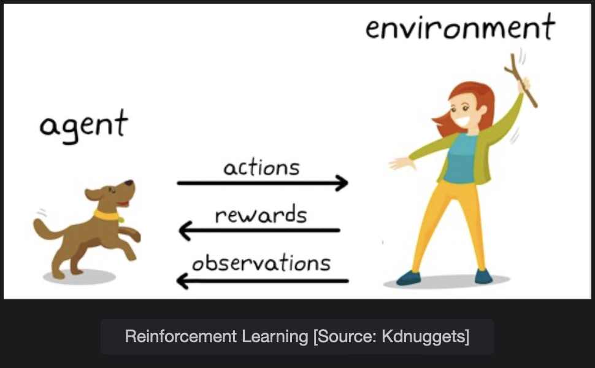
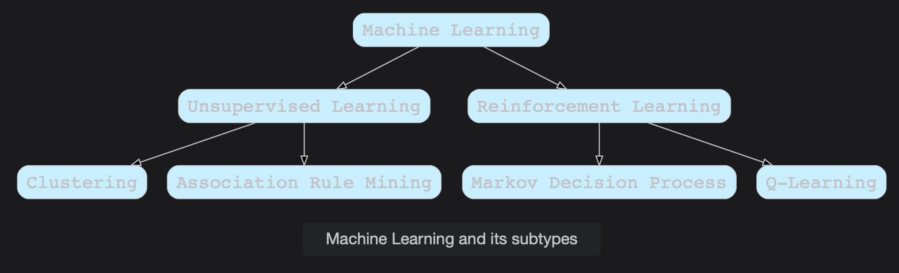

# Machine Learning and its Types

Learn about Machine Learning which is a branch of artificial intelligence and how it plays a key role in Data Science for Predictive Analytics.

> We'll cover the following:
>
> - Machine Learning
> - Types of Machine Learning
>   - Supervised learning
>     - Regression
>     - Classification
>   - Unsupervised learning
>     - Clustering
>     - Association rule mining
>       - Famous algorithms
>   - Semi-supervised learning
>   - Reinforcement learning
>     - Applications of Reinforcement Learning
>     - Learning models of Reinforcement learning

## Machine Learning

> Arthur Samuel was an American computer scientist and a poineer in the field of gaming and artificial intelligence. Artificial Intelligence is the intelligence exhibited by machines, unlike Natural Intelligence.  
>  Machine Learning is one of the sub-branch of Artificial Intelligence.  
>  Arthur Samuel coined the following definition of Machine Learning:
>
> _"Field of study that gives computers the ability to learn without explicitly programmed."_

Machine Learning along with its sub-branch called Deep Learning, is used extensively in Data Science for Predictive Analytics.  
Once the data has been carefully wrangled and all the necessary insights have been extracted, we can have the following benefits of predictive modelling using Machine Learning.

- We can calculate the probablities of occurrence of specific results in the future and take corresponding actions.
- We can automate the process of tagging numerous items in the relevant industry, which would have otherwise been only possible by involving a large amount of human labor.
- We can make real-time systems that trigger alarms before any significant accident occurs, predict the stock prices, work on several forecasting problems, and many more examples in an automated way.
- We can optimize many industrial processes and save time and money.

There are further types of Machine Learning which can be used to construct our model depending on the dataset at hand.

## Types of Machine Learning

Machine Learning has the following types:

### Supervised learning

In supervised learning, we are provided with the pre-labelled dataset. Our Machine Learning model or algorithm learns the underlying pattern from the dataset and generalized well on the new unlabelled dataset with specific hyper-parameters.  
 Supervised learning problems involve Regression and Classification problems.

##### Regression

Regression Problems involve predicting a continuous value output. This concept has been taken from Inferential Statistics.

Some typical examples of Regression Problems are:

- Predicting the house prices
- Predicting the level of toxicity of comments
- Predicting stock prices
- Predicting the number of employees in a company
- Predicting FVC measurement of patients

##### Classification

Classification problems involve predicting a category output. The output can draw from two categories (Binary Classification), more than two categories (Multi-class classfication).  
 It can also involve predicting more than one category for an instance (Multi-Label Classification).

Some classification examples involve:

- Predicting the sentiment of a tweet (positive or negative).
- Predicting whether an X-Ray contains pneumonia or not.
- Predicting the tumor of cancer as benign or malignane.
- Predicting the weather of the coming days (hot or cold).

> Dimension, Feature, Column, and Attribute are the same terms referring to the single column of a structured table.  
> Independent columns, Input columns, and Features are the columns used for prediction.  
> Dependent and Output Column are the ones that are to be predicted.  
> **Linear Models** are best suited for problems that are linearly separable and result in a model that results in a linear combination of inputs and outputs.  
>  These include Linear regression or Logistic Regression.  
> **Non-Linear Models** are best suited for problems that are not linearly separable.  
>  These include neural networks or support vector machines with Kernels. The rule of thumb is to start with Linear Models on the problems, and if there is a bad performance, shift to Non-Linear Models.

### Unsupervised learning

In unsupervised learning, the dataset comes without pre-defined labelling, meaning it is unlabeled. The goal of unsupervised learning is to learn the pattern in the dataset with no supervision provided.  
 The unsupervised learning problem involves Clustering and Association Rule Mining.

##### Clustering

Clustering refers to the process of putting similar data items in the same group. The items in the same group or cluster are said to have the same label or ID.

Clustering examples involve the following:

- Clustering users based on their usage of social media.
- Clustering customers in a mail.
- Clustering images and videos based on their content and other properties.
- Clustering newspaper articles and search results from a search engine having similar properties and content.

##### Association rule mining

Association rule mining comes under the umbrella of Unsupervised Learning.  
 Association rule mining helps us find features or dimensions, which occur together or are correlated.

- **Market Basket Analysis:** It is a technique to discover association rules between items in retail shops.
- **Medical Diagnoses:** Association Rule Mining helps in defining the relationship between symptoms and the corresponding diseases.
- **Bioinformatics:** Association rule mining helps to understand the relationship between the occurrence of different amino acid in proteins.

###### Famous algorithms

The below algorithms are used in Association Rule Mining. They help us find the Frequent pattern items from which Association Rules are derived.

- Apriori Algorithm
- FP Growth Algorithm

### Semi-supervised learning

It is expensive and time-consuming to find a large amount of labeled data. Most of the time we have a small amount of labeled data and a large amount of unlabelled data.  
 The goal of semi-supervised learning is the same as Supervised Learning. But now, unlabelled examples also contribute to understanding the underlying structure of the dataset.

**Pseudo-Labelling** is a famous technique in semi-supervised Learning.

### Reinforcement learning

Reinforcement learning (RL) is an area of Machine Learning concerned with how software agents ought to take actions in an enviroment to maximize the notion of cumulative reward.

---

In Reinforcement Learning, machines are placed in an environment and are capable of perceiving the state of the environment. The state of the environment is in the form of a **feature vector.**  
 The machine performs **actions** and these actions bring **rewards.**  
 As a result of the action, the Machine can move to a different state. The goal of a Reinforcement Algorithm is to learn a policy.

##### Applications of Reinforcement learning

- There are robots working in different industries to automate the construction process.
- It helps us reveal rewards that would be helpful in the long run.

##### Learning models of Reinforcement learning

- Markov Decision Process
- Q-Learning

