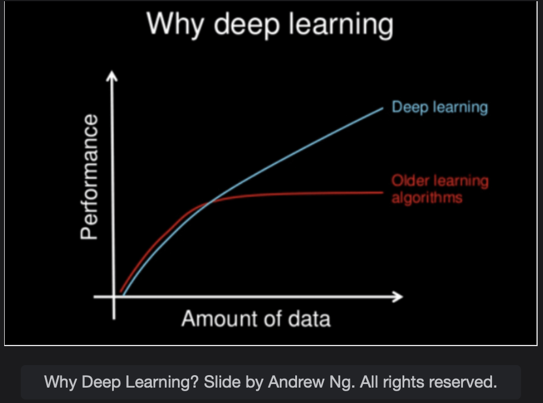

# Deep Learning and Recommender Systems

Deep Learning is a sub-branch of Machine Learning that involves using Neural Networks.  
Recommender Systems involve recommending things to the users.

> We'll cover the following:
>
> - Deep Learning
> - Recommender systems
> - Focus of this course

## Deep Learning

Deep Learning is subfield of Machine Learning that involves appropriating problems by using Artificial Neural Networks. Artificial Neural Networks are inspired by the working of the human brain. Deep Learning methods have been proven to have several advantages over classical Machine Learning methods.

A plain Neural Network has an input layer, a hidden layer, and an output layer.  
 Two famous libraries for making Neural Networks are Pytorch and Tensorflow.

#### What is Pytorch?

It is a Python-based scientific computing package targeted at two sets of audience.

- A replacement for Numpy to use the power of GPUs.
- A Deep Learning research platform that provides maximum flexibility and spped.

#### What is Tensorflow?

Tensorflow is an end-to-end open-source platform for Machine Learning. It has a compreshensive, flexible ecosystem of tools, libraries, and community resources.  
 These allow researchers to push the state-of-the-art in Machine Learning, and developers easily build and deploy Machine Learning powered applications.

#### Why use Deep Learning?

In recent years, Deep Learning methods were booming in the Data Science field due to their exceptional performance. Traditional Machine Learning based methods have a stable performance after a certain amount of data.  
 However, Deep Learning based methods, show an **increase in performance with the increase of the dataset.**

## Recommender systems

A recommender system or recommendation systems seek to predict the behaviour of a user or a customer in a particular domain.  
Let's understand it with some examples:

- When a person buys a particular item on Amazon, the site recommends similar items, saying, "You might also like".  
   This is one of the typical application of recommender systems in commercial applications.
- Netflix recommends movie titles to users based on their behavior and taste of movies they have been watching.
- Facebook recommeds posts, videos, and ads based on the activities of the users.

#### Content-Based Filtering

Content-Based Filtering recommends items based on their similarity with other items. If a person watched a movie and the genre of that movie is similar to some other movie then that movie is also recommended to the user.

#### Collaborative Filtering

Collaborative Filtering filters items for a user or a customer based on similar users or customers.  
 Collaborative Filtering has two more types:

- **User-based:** Measures the similarity between target users and other users.
- **Item-based:** Measures the similarity between the items that target users rate or how they interact with and other items.

#### Hybrid Based Filtering

In Hybrid Based Approaches, methods like content-based filtering, collaborative filtering, and Deep Learning-based methods are used for recommender systems.

## Focus of this course

- This course will focus on supervised learning, unsupervised learning, semi-supervised learning, and deep learning.
- For the rest of the topics like Reinforcement learning, we recommend the book by Richard S. Sutton. For Recommender Systems, Charu C. Aggarwal’s book is quite famous.
