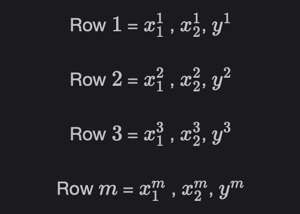

# What is Regression?

Learn about Regression in this lesson.  
 It is a concept that has been borrowed from Inferential Statistics and involves predicting a real-valued output.

> We'll cover the following:
>
> - What is Regression?
> - Key terms

## What is Regression?

Regression comes under supervised learning and it involves predicting a real-valued output.  
 Classification predicts a discrete-valued output.

## Key terms

#### Input column or Independent features

The columns that are used to predict the output column are called the input columns or independent features.  
 These are denoted as x1, x2, x3, ... xn, where x1 is the first feature and so on.

> NOTE that n denotes the total number of features or dimensions.

#### Output column or dependent feature

The column that is to be predicted is called output column or dependent feature.  
 It is denoted as y.

#### Total instances or samples

- Total number of rows or instances or samples are denoted as m.
- Samples, rows, or instances are denoted as x^1, x^2, ...and x^m.
- The first feature value for the first sample is denoted as x1^1.  
   The second feature value for the first sample is denoted as x2^1.  
   The nth feature value for the first sample is denoted as xn^1.
- If we have n = 2 features and m = 3 instances, then we will have the following representation of individual values:  
   

#### Training dataset

The dataset taken out of the original preprocessed labeled dataset on which the Machine Learning model is trained is called the training dataset.

#### Test dataset

The unseen dataset on which the model is evaluated is called the test dataset.

#### Validation dataset

We use the dataset, along with the training data set, to evaluate the performance of the trained model.  
 Depending on the model's performance, we either train the model again or finalize it.

#### Numerical and categorical features

- **Numerical columns** or features have real number values present in them, like height, price of a house, etc.
- **Categorical features** have values with which category can be associated. For example, sex can be male or female.
- Categorical features can be **ordinal or nominal**.
- **Ordinal categorical variables** have an order associated with them such as lower class, middle class, and upper class.
- **Nominal categorical variables** don't follow any order like sex.
- In Python Numerical features have the type float or int.  
   Categorical features are usually represented as object type when they are stored in Pandas Dataframe.

#### Overfitting and underfitting

When the model fails to generalize or predict accurately on the test dataset but performs well on the training dataset, this situation is called overfitting.  
 This is also referred to as **high variance.**

Underfitting is the situation where the model has very bad performance on the training dataset.  
 This situation is known as **high bias.**
