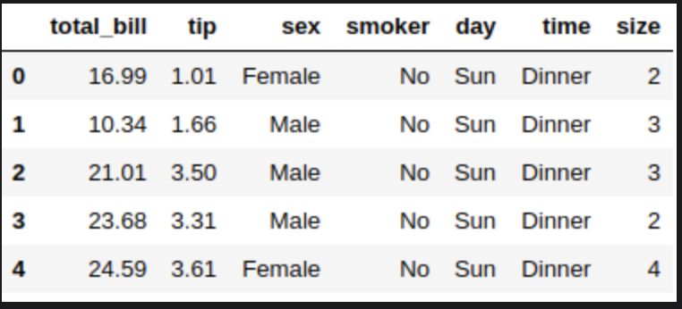
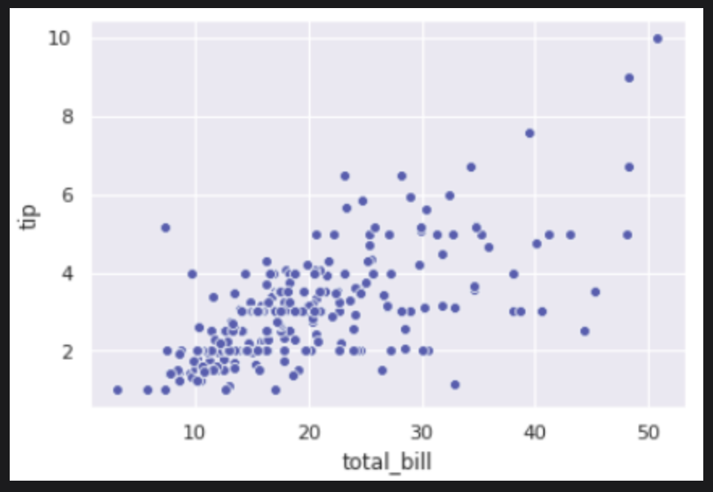
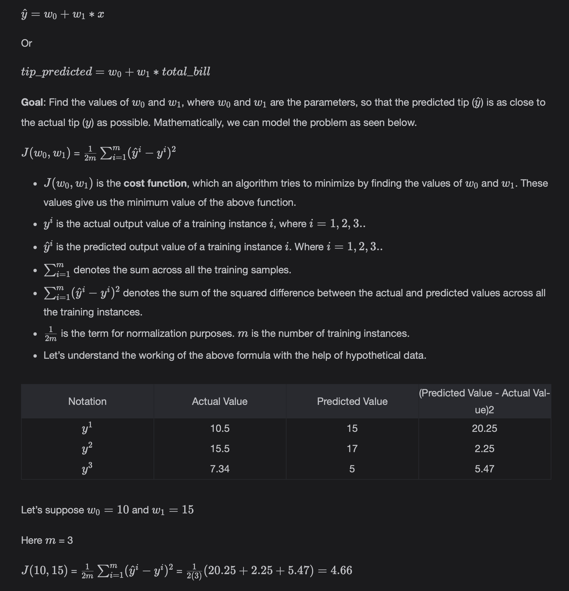
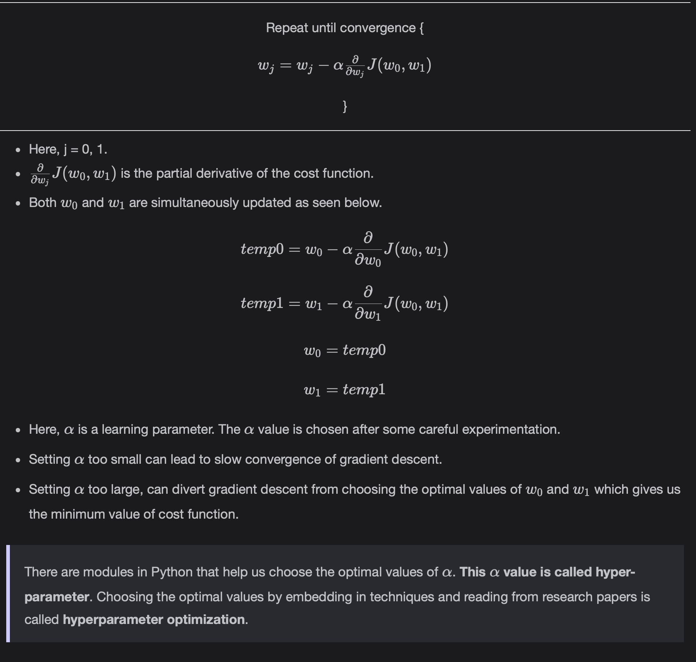
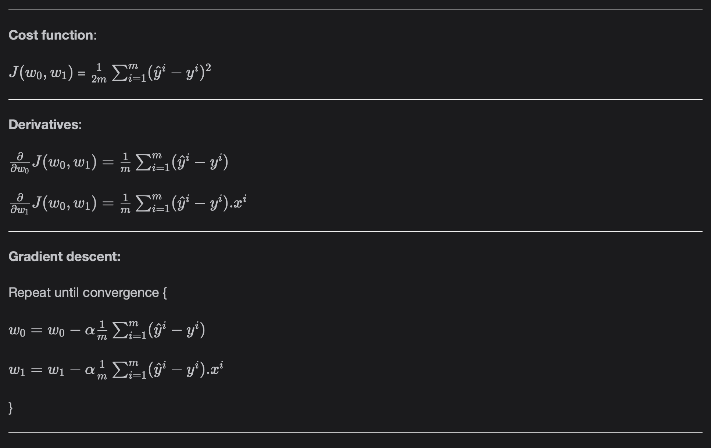

# Univariate Linear Regression

Learn more about Regression and the concepts of Univariate Linear Regression.

> We'll cover the following:
>
> - Univariate Linear Regression
>   - Working
>   - Gradient descent
>     - Intuition
>   - Gradient descent for Univariate Linear Regression
>   - Versions of gradient descent
>   - Conclusion

## Univariate Linear Regression

In Univariate Linear Regression, we have one independent variable x which we use to predict a dependent variable y.

> We will show example of Tips Dataset from Searborn's Datasets to illustrate theoretical concepts.
>
> 
>
> We will be using the following columns from the dataset for Univariate Analysis.
>
> - Total_bill : It is the total bill of food served.
> - Tip : It is the tip given on the cost of food.

**Goal of Univariate Linear Regression:** The goal is to predict the "tip" given on a "total_bill".  
 The regression model constructs an equation to do so.

If we plot the scatter plot between the independent variable (total_bill) and dependent variable (tip), we get the plot:  
 

- We can see that the points in the scatter plot are mostly scattered along the diagonal.
- This is an indication that there can be some positive correlation between the total_bill and tip. This will be fruitful in modeling.

### Working

The univariate Linear Regression model comes up with the following equation of the straight line.

### Gradieng descent

Gradient descent is an optimization algorithm that helps us find the optimal values of w0 and w1.  
It is used as a backbone behind many Machine Learning algorithms. Let's rephrase our goal.

**Goal:** Find the values of w0 and w1 that give us the minimum value of cost of the J(w0, w1) function.

Gradient descent helps us find the optimal values. It is outlines below.

- Start with initial values of w0 and w1.
- Keep changing w0 and w1 until we achieve the minimum of J(w0, w1).

##### Intuition

Gradient descent works as follows:

### Gradient descent for Univariate Linear Regression

Now, we can apply the gradient descent by opening the derivative term for Univariate Linear Regression, as seen below:

### Versions of gradient descent

- **Batch Gradient Descent:** Each step of gradient descent (i.e. updating the parameters (w0, w1)) takes the whole training dataset.
- **Stochastic Gradient Descent:** Gradient Descent performs steps (i.e. updating the parameters (w0, w1)) after every training instance or sample. This is also called **online learning or incremental or out-of-core learning**.
- **Mini-Batch Stochastic Gradient descent:** Gradient Descent takes steps (i.e. updating the parameters after a defined set of the training sets) that are called **batch size.**

### Conclusion

Once the gradient descent has done its job of finding the w0, w1 parameters, we can place the values back into the equation and get the tip_predicted for a particular total_bill.

    tip_predicted = w0 + w1 * total_bill

Let's suppose gradient descent returns w0 = 10 and w1 = 15.

    tip_predicted = 10 + 15 * total_bill
