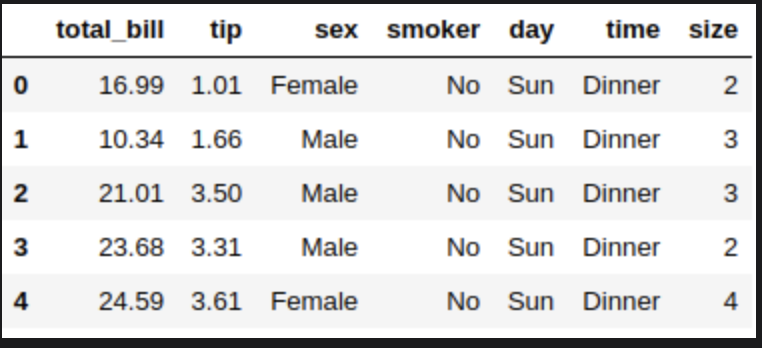
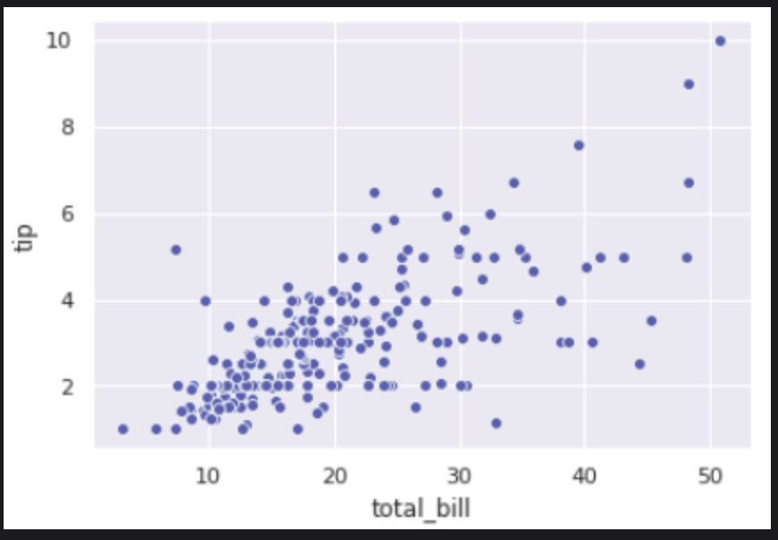
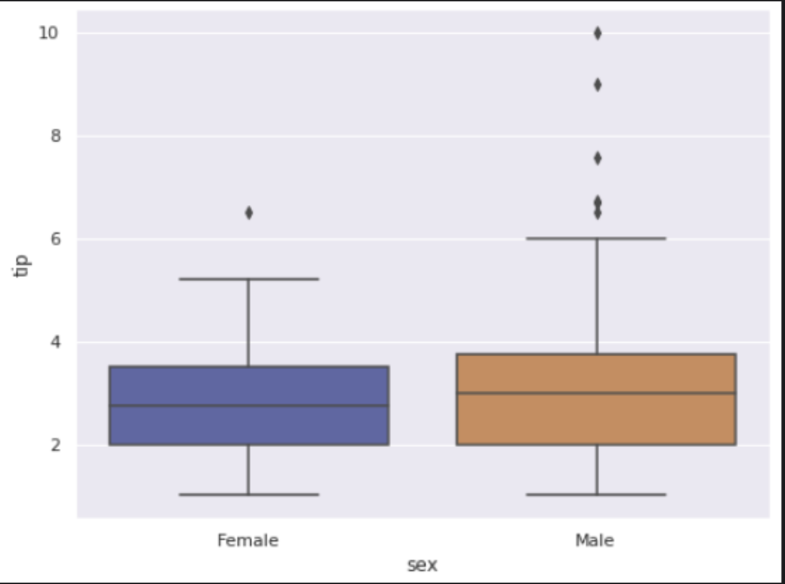
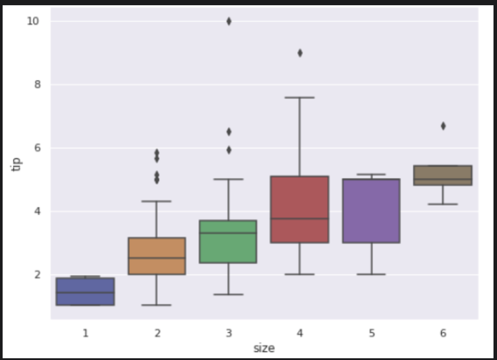
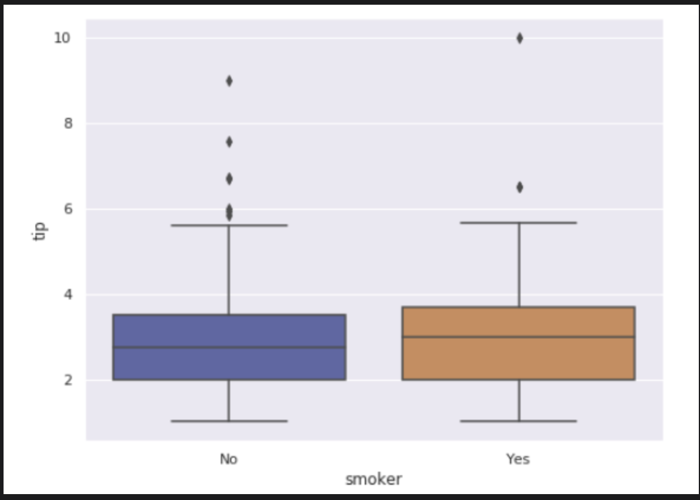
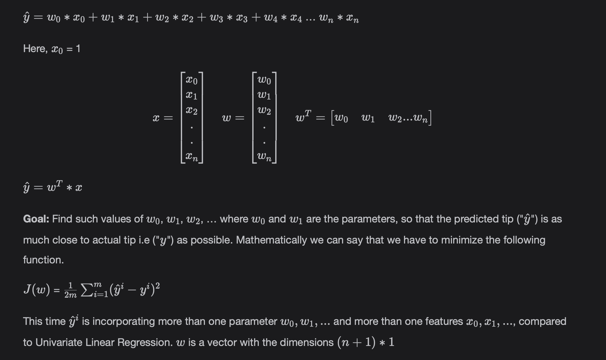
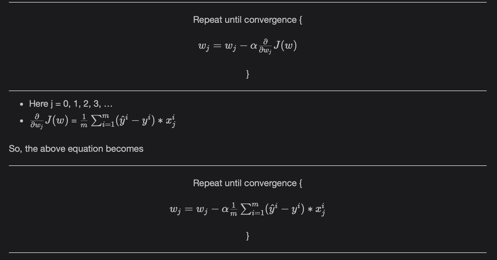

# Multivariate Linear Regression

With an understanding of Regression, learn about Multivariate Linear Regression in this lesson.

> We'll cover the following:
>
> - Multivariate Linear Regression
>   - Working
>   - Gradient Descent
> - Acknowledgement

## Multivariate Linear Regression

In Multivariate Linear Regression, we have multiple input or independent features. Based on these features, we predict an output column.  
Again let's use the Tips Dataset.

We'll use the following columns from the dataset for Multivariate Analysis.

- **Total_bill:** It is the total bill of food served.
- **Sex:** It is the sex of the bill payer.
- **Size:** It is the number of people visiting the restaurant.
- **Smoker:** Is the person a smoker or not?
- **Tip:** It is the tip given on the meal.

**Goal of Multovariate Linear Regression:** The goal is to predict the "tip", given all the independent features above. The Regression model constructs an equation to do so.

- We plot the **Scatter plot** between the numeric independent variables (total_bill) and numeric output variable (tip) to analyze the relationship.
- We plot the **BoxPlot** between the categorical independent variables (sex, size and smoker) and the numeric output variable (tip) to analyze the relationship.

---

- You can see that the points in the Scatter plot are mostly along the diagonal.
- This indicates that there might be some positive correlation between the total_bill and tip. This will be fruitful in modeling.

---

- We can see that males tend to give more tips than females.
- There are some outliers in males who have given exceptional tips as can be seen on the upper whisker above. There is an outlier in females too.

---

- We can see that the tip tends to increase with the number of people. It is visible from the upward trend of Box-Plots. So, this will be fruitful in modeling.
- There are some outliers in the size of two and three.

---

- We can see that people who smoke tend to give a little higher tip.
- There are many outliers in the people who do not smoke.

#### Working

Multivariate Linear Regression comes up with the following equation in higher dimensions:

#### Gradient Descent

Gradient descent changes as below

## Acknowledgement

Thanks to Andreq Ng from Stanford University for providing amazing resources to explain the mathematical foundations of models.
