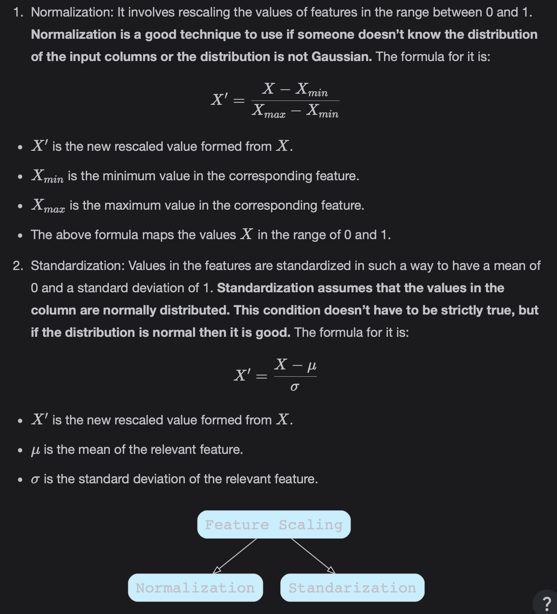

# Feature Scaling

We'll uncover the details surrounding Feature Scaling, which is an important step before training the models **because it speed up the computations while building the model**.

> We'll cover the following:
>
> - Feature scaling
>   - Benefits
>   - Types of feature scaling

## Feature scaling

Feature scaling comes under Feature Engineering. Feature scaling refers to the process of normalizing the features, or columns, or dimensions.  
 Many Machine Learning algorithms are sensitive to the scale or magnitude of the features.

#### Benefits

It has the following benefits:

- It helps in gradient descent based algorithms to converge faster.
- It helps in distance-based algorithms to give equal weight to each feature while computing the similarity.
- It helps to compare the Feature Importance.

> Distance-Based Algorithms take into account the distance or similarity between instances of the dataset to do the computation.

#### Types of feature scaling

There are these two famous types of feature scaling:

- **Normalization:** It involves rescaling the values of features in the range between 0 and 1. Normalization is a good technique to use if someone doesn't know the distribution of the input columns or the distribution is not Gaussian.
- **Standardization:** Values in the features are standardized in such a way to have a mean of 0 and a standard deviation of 1. **Standardization assumed that the values in the columns are normally distributed. This condition doesn't have to be strictly true, but if the distribution is normal then it is good.**

