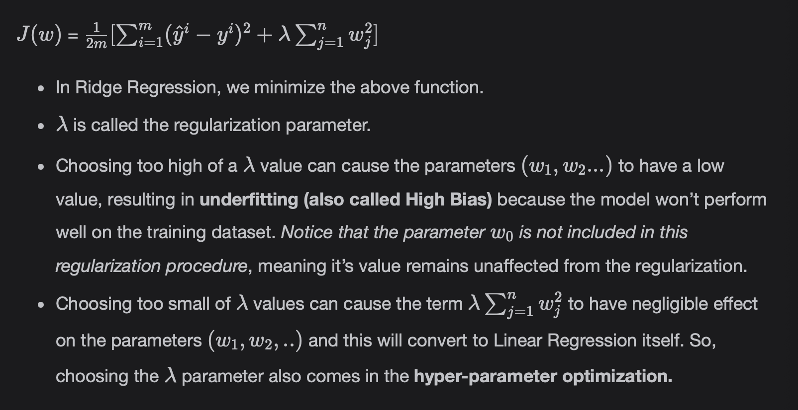
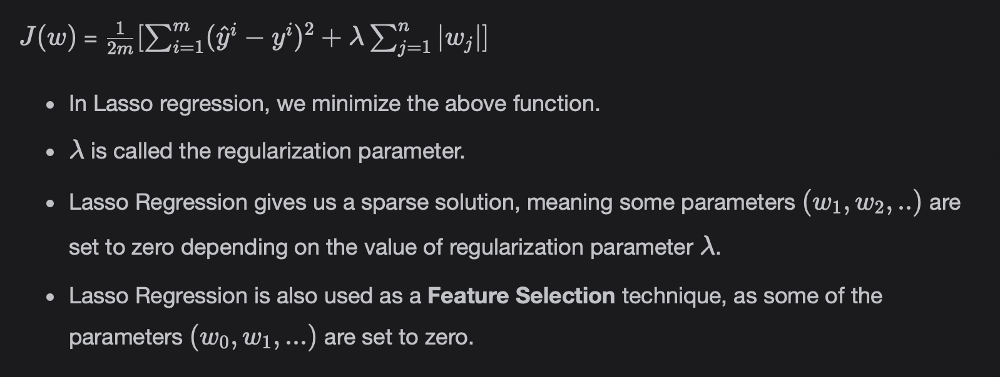

# Regularization (Lasso, Ridge, and ElasticNet Regression)

Learn more about Regularization. Specifically, it helps us **deal with overfitting problems** in Machine Learning models.

> We'll cover the following:
>
> - Regularization
>   - How high variance (overfitting) can be reduced
> - Ridge Regression
>   - Ridge Regression in Scikit Learn
> - Lasso Regression
>   - Lasso Regression in Scikit Learn
> - Elastic Net Regression
>   - Implementation in Scikit Learn

## Regularization

We use overfitting to describe when the model learning is performing well on the training dataset but fails to generalize on the unseen or test dataset.  
 This condition is also mentioned because the model is suffering from **high variance.**

Overfitting on the training data can be illustrated as:  
 J(w) ~ 0

In other words, our predicted values are so close to the actual values, that the cost goes to zero and the model has memorized everything.

#### How high variance (overfitting) can be reduced

- The first strategy is to look for more training data so that the data has more variety in it.
- Regularization, which will be focus of this part of lesson is also used to tackle overfitting.
- Employ good Feature Selection techniques.
- There are also some specific Deep Learning techniques for reducing the high variance.

Now, lets look into how Regularization are used to overcome overfitting.

## Ridge Regression

The following steps demonstrate how the cost function is modified in Ridge Regression, sometimes called L2-Regularization.

#### Ridge Regression

Ridge class is used for making Ridge Regression model.

        import pandas as pd
        from sklearn import linear_model
        from sklearn.metrics import mean_squared_error
        from sklearn.model_selection import train_test_split

        dataset = pd.read_csv("tips.csv")

        X = dataset[["total_bill"]]
        y = dataset[["tip"]]

        X_train, X_test, y_train, y_test = train_test_split(X, y, random_state=0, train_size=0.7)

        # passes in alpha=0.5 which is meant for the Regularization Parameter
        reg = linear_model.Ridge(alpha=0.5)
        reg.fit(X_train, y_train)
        y_pred = reg.predict(X_test)

        print("The MSE on test set is {0:.4f}".format(mean_squared_error(y_test, y_pred)))

## Lasso Regression

The following steps demonstrate how the cost function is modified in Lasso Regression, sometimes called L1-regularization.

#### Lasso Regression in Scikit-Learn

The Lasso class is used for making the Lasso Regression model.

        import pandas as pd
        from sklearn import linear_model
        from sklearn.metrics import mean_squared_error
        from sklearn.model_selection import train_test_split

        dataset = pd.read_csv("tips.csv")

        X = dataset[["total_bill"]]
        y = dataset[["tip"]]

        X_train, X_test, y_train, y_test = train_test_split(X, y, random_state=0, train_size=0.7)

        # passed alpha=0.5, which is meant for Regularization Parameter
        reg = linear_model.Lasso(alpha=0.5)
        reg.fit(X_train, y_train)
        y_pred = reg.predict(X_test)

        print("The MSE on test set is {0:.4f}".format(mean_squared_error(y_test, y_pred)))

## Elastic Net Regression

Elastic-Net Regression incorporated both L1-Regularization and L2-Regularization while building the Linear Regression Model.  
This allows us:

- Learn a sparse model where few of the weights or parameters (w0, w1...) are non-zero like Lasso (L1-Regularization).
- Maintain the properties of Ridge Regression (L2-Regualarization).

#### Implementation in Scikit Learn

The ElasticNet class implements the ElasticNet model.

        import pandas as pd
        from sklearn import linear_model
        from sklearn.metrics import mean_squared_error
        from sklearn.model_selection import train_test_split

        dataset = pd.read_csv("tips.csv")

        X = dataset[["total_bill"]]
        y = dataset[["tip"]]

        X_train, X_test, y_train, y_test = train_test_split(X, y, random_state=0, train_size=0.7)

        # passes in l1_ratio=0.5
        reg = linear_model.ElasticNet(l1_ratio=0.5)
        reg.fit(X_train, y_train)
        y_pred = reg.predict(X_test)

        print("The MSE on test set is {0:.4f}".format(mean_squared_error(y_test, y_pred)))

> l1_ratio is the ElasticNet mixing parameter with a value between 0 and 1.
>
> - For l1_ratio = 0, L2-Regularization is used.
> - FOr l1_ratio = 1, L1-Regularization is used.
> - For 0 < l1_ratio < 1, the combination of both L1 and L2 are used.
