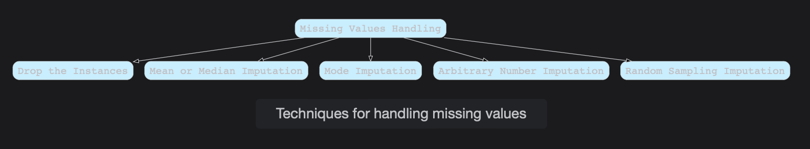
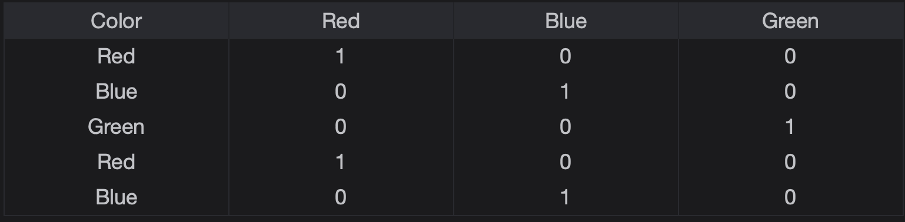

# Feature Engineering and Categorical Variables Encoding

We'll explore the information behind Categorical Variables encoding. It enables us to convert the categorical variables into Numerical ones so that they can be processed by Machine Learning Algorithms.

> We'll cover the following:
>
> - Feature Engineering
> - Missing values
>   - Dealing with missing values
> - Categorical Variables encoding
>   - One hot encoding
>   - Ordinal encoding
>   - Count or Percentage encoding
>   - Encoding with the mean of the target

## Feature Engineering

**Feature Engineering** helps us build complex models using the preprocessed features at hand.  
**Feture Selection** involves taking only a handful of preprocessed features for building the model.

These two steps are part of every model building pipeline.

## Missing values

Features of the input Dataset can contain missing values due to certain reasons. Filling in the missing values or, perhaps throwing out the features or instances with a large number of missing values is an important part of the pipeline.

**Data Imputation** is the technique used for estimating the missing values.

#### Dealing with missing values

- **Drop the instances:** The first technique is to drop the instances or features with at least one missing value. The variation in it can be dropped to the instances in which values are missing in any of the defined features.
- **Mean or Median Imputation:** This refers to replacing the missing value with the mean or median of the respective feature. Mean or median is calculated on the training dataset, and it is also used in the dataset if the values are missing.
- **Mode or Frequent Category Imputation:** This imputation is used for mostly Categorical variables and involves replacing the missing values with the most common value in the feature.
- **Arbitrary Number Imputation:** This involves replacing the missing value with an arbitrary value. The most common used value for numerical feature are 999, 9999, or -1. In case of a missing value for a Categorical variable, it is replaced by the Missing string value.
- **Random sampling imputation:** This consists of extracting random observations from the pool of available values in the feature. **Random sampling imputation preserves the original distribution**, which differs from the other imputation technique that we've discussed in this lesson and is suitable for numerical and categorical variables alike.

## Categorical Variables encoding

Categorical Variables encoding refers to the encoding of Categorical Variables before giving them to the Machine Learning model.

#### One hot encoding

One hot encoding is one of the most frequently used encoding techniques for Categorical Variables especially in cases where the number of unique values in the categorical variables is not high.

It represents a categorical variable as a group of binary variables, where each binary variable represents one category.

The following table represents the one hot encoding of the color variable which can have values red, blue, or green.  

> **Important Note:** We represent a Categorical Variable with k-unique values as k-1 binary variables. For the color variable, which has three categories (k=3: red, blue, and green), we need to create two (k-1 = 2) binary variables to capture all the information so that the following occurs:
>
> - If the observation is red, the variable red will capture it (red = 1, blue = 0).
> - If the observation is blue, the variable blue will capture it (red = 0, blue = 1).
> - If the observation is green, the combination of red and blue will capture it (red = 0, blue = 0).

We go with encoding a Categorical Variable with k unique values in the following cases.

- When we want to determine the importance of each value in a categorical variable
- In Feature Selection Techniques like Recursive Feature Selection
- When the training for Decision Trees is done

#### Ordinal encoding

Ordinal encoding refers to the encoding of each value of the Categorical Variable with a unique number in increasing order.  
 This is used when there is an order in the values of Categorical Variables like temperature categorical variable with the value of high, medium, and low.

Scikit Learn provides **OrdinalEncoder** for encoding the imput categorical variables using this technique.

#### Count or Percentage encoding

In Count encoding, we replace a value of a Categorical Variable with the number of times the value occurs or the value's percentage of the occurrence.

- If 20 out of 100 observations or rows are showing blue color for categorical variable color, then this blue value will be replaced with 20 or 0.2.

#### Encoding with the mean of the target

This technique involves encoding a value of a categorical variable with the mean of the values in the target column or the column that is to be predicted.  
 This corresponds to that value of the categorical variable.
