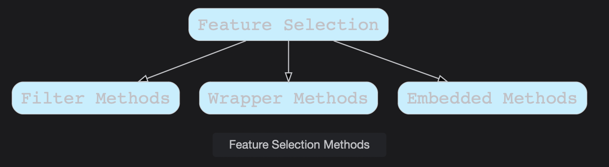

# Feature Selection (Intrinsic Methods)

Feature Selection refers to the process of selecting the most appropriate features for making the model.

> We'll cover the following:
>
> - Intrinsic or Embedded Methods
>   - Scikit Learn implementation

## Intrinsic or Embedded Methods

Embedded methods learn about the features that contribute the most to the model's performance while the model is being created.  
 You have seen Feature Selection methods in the previous lessons, and we will discuss several more in future lessons, like Decision Tree based methods.

- Ridge Regression (l2-Regularization)
- Lasso Regression (l1-Regularization)
- Elastic-Net Regression (uses both l1 and l2 Regularization)
- Decision Tree-based Methods (Decision Tree Classification, Randon Forest Classification, XgBoost Classification, LightGBM).

We know regularization reduces some of the parameters in the equation below to zero.  
This property of regularization methods can be used as a Feature Selection Method.  
 y=w0+x1w1+x2w2+x3w3...+xnwn
​

#### Scikit Learn implementation

We have already covered the implementation of regularization models like Ridge, Lasso, and Elastic-net regression in the previous lessons.

- Scikit Learn provides a **SelectFromModel class.**
- It is used with models that provide **coef\_** or **feature_importance\_** attributes.
- It takes in a **threshold** parameter.
- The features are considered unimportant and removed if the corresponding **coef\_** or **feature_importances\_** values are below the provided **threshold** parameter.

