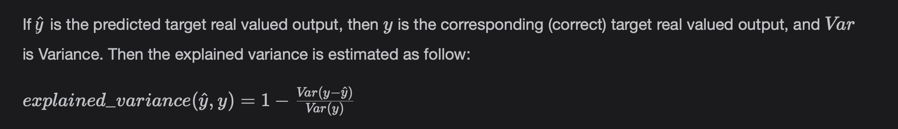
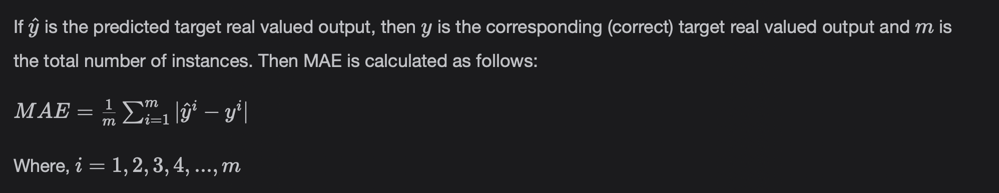
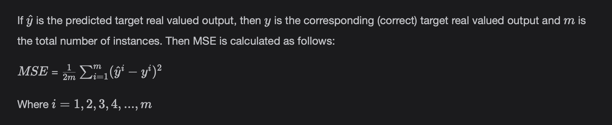

# Model Evaluation Measures (Explained Variance Score, MAE, MSE)

Look at different evaluation measures for Regression Models.

> We'll cover the following:
>
> - Regression Models Evaluation Metrics
>   - Explained Variance Score
>     - Formula
>     - Code
>   - Mean absolute error
>     - Formula
>     - Code
>   - Mean squared error
>     - Formula
>     - Code

## Regression Models Evaluation Metrics

Once we have built a model on the training dataset, it is time to evaluate the model on the test dataset to check how good or bad it is.  
It will also help us know

- If the model is overfitting
- If the model is underfitting
- If we need to revise our Feature Engineering or Feature Selection techniques.

We use the following measures to assedd the performance of a Regression Model.

#### Explained Variance Score

Explained Variance is one of the key measures in evaluating the Regression Models.  
 In statistics, explained Variation measures the proportion to which a regression model accounts for the variation (dispersion) of a given dataset.

###### Formula

The best possible score is 1.0. The lower values are worse.

###### Code

The code examples have been taken from Scikit Learn Documentation. In all the codes below:

- y_true are the actual hypothetical values.
- y_pred are the predicted hypothetical values.

        from sklearn.metrics import explained_variance_score

        y_true = [3, -0.5, 2, 7]
        y_pred = [2.5, 0.0, 2, 8]
        print(explained_variance_score(y_true, y_pred))

#### Mean absolute error

The Mean Absolute error (MAE) measures the average magnitude of the errors in a set of predictions, without considering their direction. Lower values are good.

###### Formula

###### Code

        from sklearn.metrics import mean_absolute_error

        y_true = [3, -0.5, 2, 7]
        y_pred = [2.5, 0.0, 2, 8]
        print(mean_absolute_error(y_true, y_pred))

#### Mean squared error

The cost function which Gradient Descent minimized in the case of Linear Regression while the learning parameters (w1, w2, ...) also called the Mean Squared Error. Lesser values are good.  
 Taking the square root of the value gives us **Root Mean Square** Error (RMSE).

###### Formula

###### Code

        from sklearn.metrics import mean_squared_error

        y_true = [3, -0.5, 2, 7]
        y_pred = [2.5, 0.0, 2, 8]
        print(mean_squared_error(y_true, y_pred))
