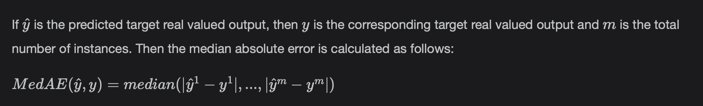
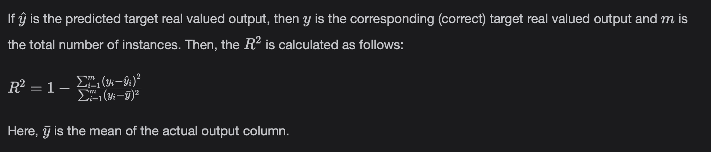

# Model Evaluation Measures (Median Absolute Error, R^2 Score)

Look at different evaluation measures for Regression Models.

> We'll cover the following:
>
> - Median absolute error
> - R^2 score, the coefficient of determination
> - Key Take Aways

## Median absolute error

Median is a Descriptive Statistics Measure and is robust to outliers in the dataset. The rate of error is calculated by taking the medain of all absolute differences between the target and the prediction.  
 Lower values means the model is more accurate.

#### Formula

#### Code

        from sklearn.metrics import median_absolute_error
        y_true = [3, -0.5, 2, 7]
        y_pred = [2.5, 0.0, 2, 8]
        print(median_absolute_error(y_true, y_pred))

## R^2 Score, the coefficient of determination

According to the Corporate Finance Institute, **R-Squared (R^2), or the coefficient of determination,** is a statistical measure in a regression model that determines the proportion of variance in the dependent variable that can be explained by the independent variable.  
 In other words, R-Squared shows how well the data fits the Regression model, meaning (the goodness of fit).

#### Formula

The best possible score is 1.0, and it can be negative (because the model can become worse). A constant model that always predicts the expected value of y, disregarding the input features, would get a R^2 score of 0.0.

#### Code

        from sklearn.metrics import r2_score
        y_true = [3, -0.5, 2, 7]
        y_pred = [2.5, 0.0, 2, 8]
        print(r2_score(y_true, y_pred))

## Key Take Aways

- Root Mean Square Error (RMSE) provides a better interpretation than the Mean Square Error (MSE) and it is simplified after taking the square root.
- The Root Mean Squared Error(RMSE) should be more useful when large errors are particularly undesirable.
- MSE, RMSE, or MAE are better used to compare performance between different Regression models.
- R^2 is preferable to explain the results of Regression models to executives and other non-technical people.
- We use MAE if we do not want to penalize large prediction errors.
