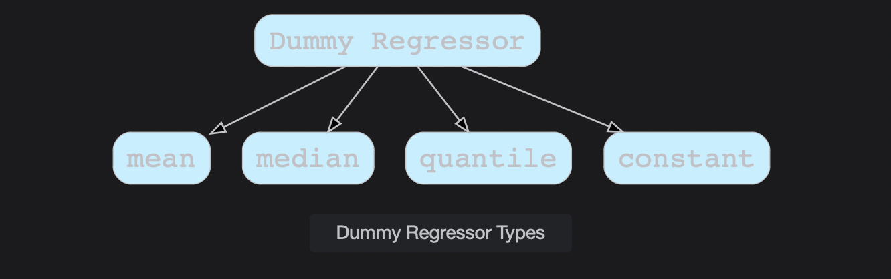

# Dummy Regressors

Learn about Dummy Regressors, which enables us to build baseline Regression models.

> We'll cover the following:
>
> - Dummy Regressors

## Dummy Regressors

In Machine Learning, **we start working on the problem, by developing a baseline model** and then improve upon the model using other models or other Feature Selection or Engineering Techniques.

> There is a famous saying:  
>  _All models are wrong, but some are useful._

Scikit learn provides us with DummyRegressor, which involves using simple rules to make predictions and developing a baseline model for the regression problem at hand. It is not recommended for real time problems.  
 The DummyRegressor class takes in a parameter **str, which stands for strategy.** This parameter decides which technique to use for making predictions. It can take one of the following values:

- **"Mean":** Always predicts the mean of the training targets.
- **"Median":** Always predicts the median of the training targets.
- **"Quantile":** Always predicts a user-provided quantile of the training targets.
- **"Constant":** Always predicts a constant value that is provided by the user.

In all these strategies, the model's predict method completely ignores the input data.

