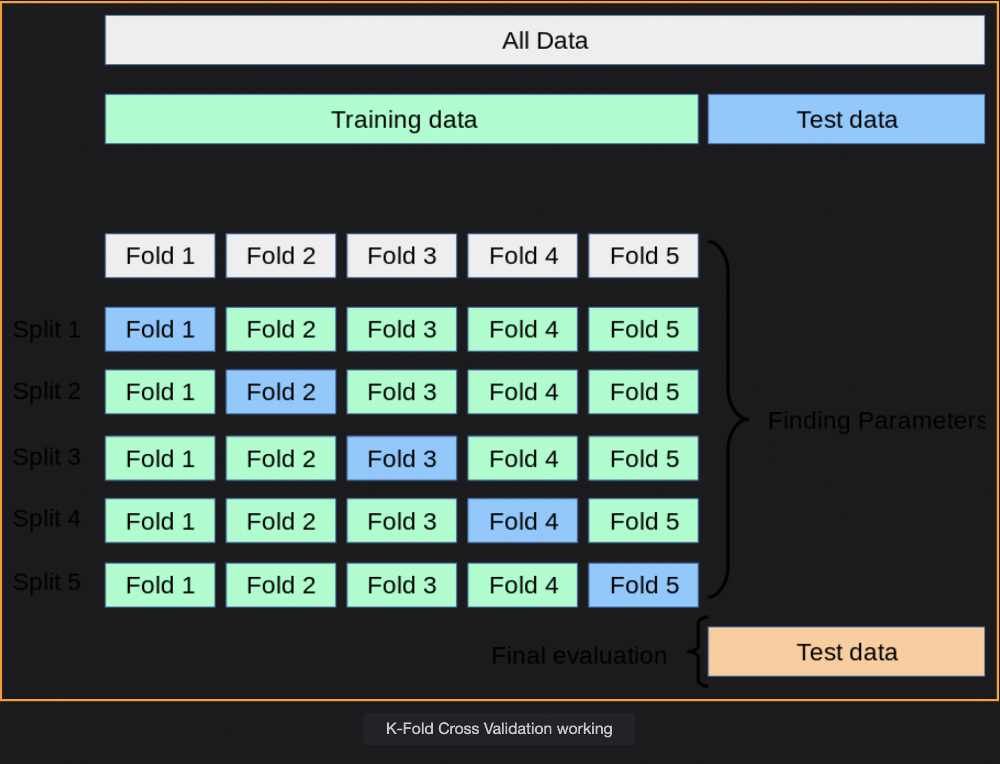

# Cross Validation

Cross Validation is a technique for making robust models.

> We'll cover the following:
>
> - Train, test and validation Datasets
>   - Validation dataset
>     - Drawback
>     - Solution
> - What is Cross-Validation?
>   - k-Fold Cross-Validation
>   - Leave One Out (LOO) Cross-Validation
>   - Rule of thumb

## Train, test and validation datasets

We divide the dataset at hand into training and test dataset.

- We train the model on the training dataset and evaluate its performance.
- We evaluate the model's performance on the test dataset (on which is not trained) and report the performance of the model.
- Scikit Learn provides **train_test_split**, which gives us the training and test dataset.

These code snippets have been taken from the Scikit Learn Documentation itself.

        import numpy as np
        from sklearn.model_selection import train_test_split
        from sklearn import datasets
        from sklearn import svm

        # imports the iris dataset
        X, y = datasets.load_iris(return_X_y = True)
        print("Original Shape of input and output columns")
        print(X.shape)
        print(y.shape)

        # splits the dataset into the training and the test datasets
        X_train, X_test, y_train, y_test = train_test_split(X, y, test_size=0.4, random_state=0)

        print("Shape of the training dataset's input and output columns")
        print(X_train.shape)
        print(y_train.shape)

        print("Shape of the test dataset's input and output columns")
        print(X_test.shape)
        print(y_test.shape)

- train_test_split splits the dataset into training and the test datasets. test_size specifies the percentage of instances to be kept in the test dataset.  
   In the current case, 40% of the rows are kept in the test dataset.

#### Validation dataset

When evalating different settings, "hyperparameters" for models, such as α (learning rate) setting that must be manually set for a Ridge Regression, there is still a risk of overfitting on the test set because the parameters can be tweaked until the model performs optimally.  
 This way, knowledge about the test set can "leak" into the model and evaluation metrics no longer report on generalization performance.

To solve this problem, yet another part of the dataset can be held out as a so-called **validation set.**  
 Training proceeds on **the training set**, after which evaluation is done on the validation set.  
 When the experiment seems to be successful, final evaluation can be done on the **test set.**

###### Drawback

While introducing the third dataset called validation dataset, the number of samples for training the model has been drastically reduced.

###### Solution

To overcome the above problem of having less instances for training we introduce the concept of **Cross-Validation.**

## What is Cross-Validation?

Cross-Validation is a technique to evaluate models that overcome the drawback described above. The test dataset is still needed for the final evaluation of the model, however, the validation dataset is not needed.

#### k-Fold Cross-Validation

k-Fold Cross-Validation technique is an approach of Cross-Validation. We follow the below steps in k-Fold Cross-Validation.

- The training Dataset is split into k smaller sets.
- A model is trained using k-1 of the folds as training data.
- The resulting model is validated on the remaining part of the data meaning it is used as a test set to compute a performance measure such as R^2 value.
- The performance measure reported by k-fold Cross Validation is then the average of the values computed in the loop.

- if we take k=2, we will have two splits.
  import numpy as np
  from sklearn.model_selection import KFold

        X = ["a", "b", "c", "d"]
        kf = KFold(n_splits=2)
        count = 0
        for train, test in kf.split(X):
            print("Split %i : Train %s Test %s" % (count, train, test))
            count = count + 1

#### Leave One Out (LOO) Cross-Validation

Leave One Out (LOO) is a simple Cross-Validation technique.  
If we use k = m, where m is the number of instances, in k-fold cross-validation then it falls to the Leave One Out (LOO) cross-validation technique.  
 Now each single instance act as a **test dataset** in different splits and the rest instances acts as **training dataset.** Thus, for m samples, we have m different training sets and different test sets.

This Cross-Validation procedure does not waste much data as only one sample is removed from the training set. This method of **Cross-Validation is computationally expensive.**

        from sklearn.model_selection import LeaveOneOut

        X = ["a", "b", "c", "d"]
        loo = LeaveOneOut()
        count = 0
        for train, test in loo.split(X):
            print("Split %i : Train %s Test %s" % (count, train, test))
            count = count + 1

        Output
        Split  0 : Train [1 2 3] Test [0]
        Split  1 : Train [0 2 3] Test [1]
        Split  2 : Train [0 1 3] Test [2]
        Split  3 : Train [0 1 2] Test [3]

**Splits -> Folds -> Indices**

- Notice how each element act as a **test set** in each split.

#### Rule of thumb

As a general rule, most authors, and empirical evidence suggest that five or ten-fold Cross-Validation should be preferred over LOO.  
 Kaggle competitions mostly use five or ten fold cross validation for the evaluation of the model.
