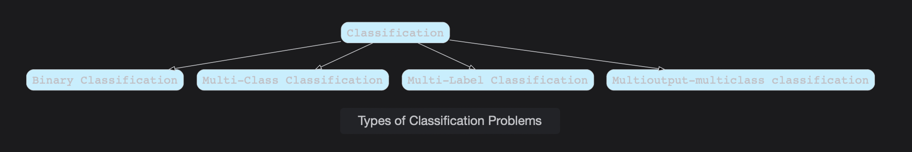

# Types of Classification Problems

Classification refers to the prediction of discrete value outcomes. Learn about this idea in detail from reading this lesson.

> We'll cover the following:
>
> - Types of Classification Problems
>   - Binary Classification
>   - Multi-class classification
>   - Multi-label classification
>   - Imbalanced Classification
>   - Multioutput-multiclass Classification (Multi-task Classification)

## Types of Classification Problems

In classification, we come across problems that have instances with a label or class marked to them. One such example of a classification model learns the underlying pattern of the training dataset, which is labeled with some classes.

We have following category of problems in classification.

#### Binary Classification

In Binary Classification problems, instances of data are labelled with two classes. The following problems fall under the umbrella of Binary Classification problems.

- Animal in the picture can be recognized as cars or dogs.
- Churn Prediction, which involves detecting the customers who might avail or cancel a subscription to a Business.
- Medical Testing which tells whether a person has a particular disease or not.

There are many famous classification models used for Binary Classification Problems.

#### Multi-class classification

In Multi-class classification problems, instances of data are labelled with more than two classes. The following examples come under the umbrella of Multi-Class Classification.

- Optical Character Recognition, which involves classifying digits from the images into one of the ten digits.
- Classifying a city's weather into one of the following classes, dry, hot, cold, or humid.
- Face Recognition which involves classifying a person's face as one of the faces in/out of a group of people.

Algorithms that are designed for Binary Classification can be adapted for use for Multi-class problems.

This involves using a strategy of fitting multiple Binary Classification models for each class versus all other classes called one-vs-rest or one model for each pair of classes, called one-vs-one.

**One-vs-Rest or One-vs-All:** This fits one binary classification model for each class vs. all other classes.
**One-vs-One:** This fit one Binary Classification model for each pair of classes.

#### Multi-label Classification

Multi-label Classification involves predicting more than one label for each instance.  
Multi-class Classification involves predicting just one label for each instance, and here lies the key difference.

The following examples fall under the umbrealla of Multi-label Classification.

- A picture might consists of multiple objects like car, aeroplane, and train, and the task might be to predict all the labels of the image.
- Predicting multiple labels of cancers for an instance containing properties of a patient.

Classification algorithms used for Binary or Multi-class Classification cannot be used directly for Multi-Label Classification.  
 Specialized versions of standard classification algorithms can be used (so-called Multi-label version of the algorithm).  
 Another approach is to use a Separate Classification algorithm to predict the labels for each class.

#### Imbalanced Classification

Imbalance Classification refers to the task of classification where the number of instances in each class are unequally distributed.  
 Most problems in the industry involve Imbalanced Classification.  
 Having unequal distribution of instances in the training set might result in a biased model that is trained on the majority class.

> The following examples can fall under the umbrella of Imbalanced Classification problems:
>
> - Image of the patient's skin with melanoma present in them: In real-life scenarios, we have less image of malignant cases and more images of benign cases.
> - The use case of fraud detection: Most of the transactions that happen daily are normal. Fraudulent transactions do not happen as normal transactions, and detecting them is a challenge.

We can deal with the imbalance Class problem with anyone of the following technique:

1. We can change the composition of instances present in the training Dataset by either undersampling the majority class instances or oversampling the minority class instances.
2. We can use the Cost-sensitive Machine Learning algorithms which pay more attention to minority class instances when training the model.
3. Using the right evaluation measures for checking a model's performance can help us to detect an imbalanced class problem and fix them.

#### Multioutput-multiclass Classification (Multi-task Classification)

In Multi-output-multiclass classification or Multitask Classification, a single classifier handles several joint classification tasks. It helps alleviate the data sparsity problems by exploiting useful information from other related learning tasks for a given task.  
 It is used a lot in the area of Deep Learning.

In Natural Language Processing, we learn jointly for NLP tasks, including Part-of-Speech Tagging, Chunking, Named Entity Recognition, and Language Modelling.  
 These types of problems fall under the domain of Multi-task Learning.
