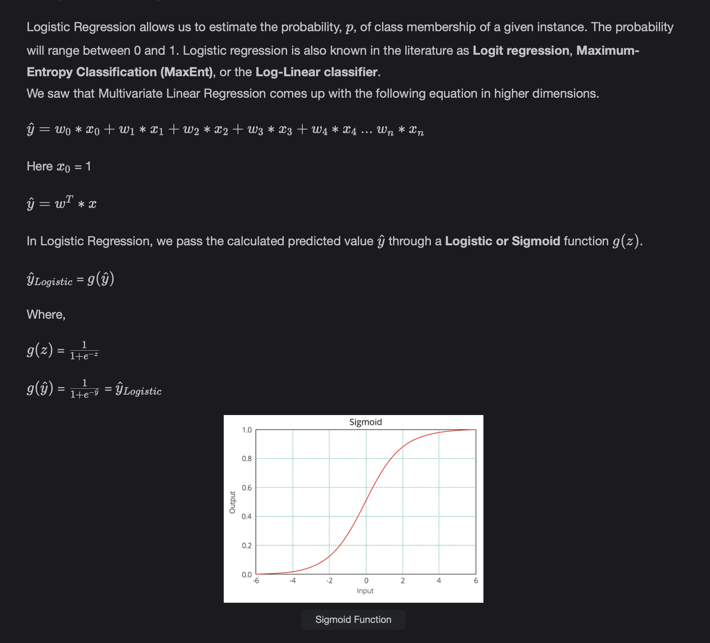
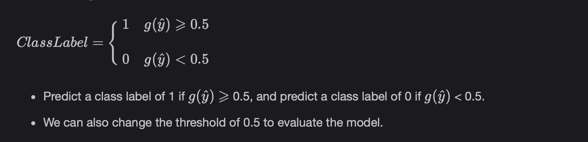
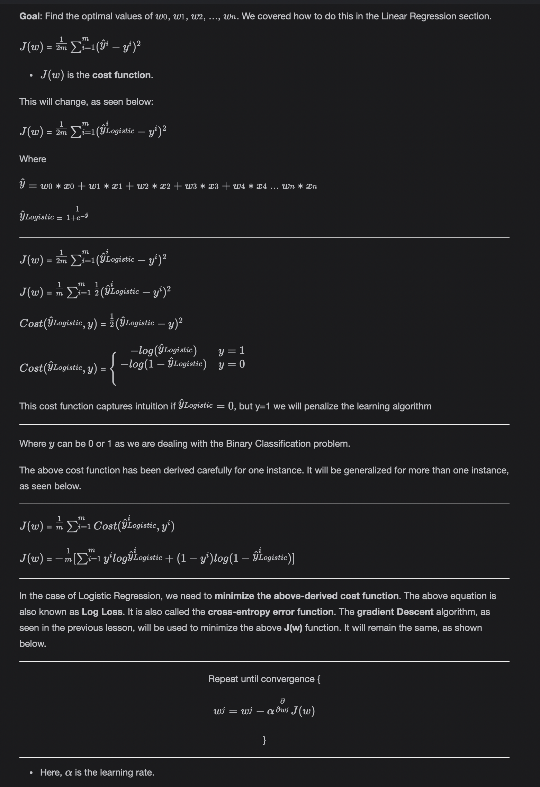
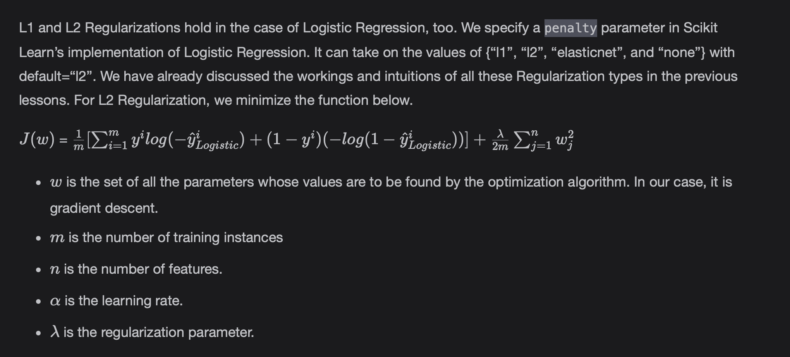

# Logistic Regression

Logistic Regression is a famous classification algorithm, and it is used extensively in the field.

> We'll cover the following:
>
> - Classification
> - Logistics Regression
>   - Inducing the Predictions
>   - Working
>   - Regularizaion
> - Extending Logistic Regression for advance problems
> - Scikit Learn Implementation

## Classification

Classification problems involve assigning labels or classes to instances.  
 For example, an email can be spam or ham (not Spam). Logistic Regression is the basis algorithm used for the Binary Classification problems. It can be extended for Multi-class and Multi-label Classification problems.

In this lesson, we will cover the mathematical working of Logistic Regression and how it can be used in Scikit Learn for real time problems.

## Logistic Regression

Logistic Regression allows us to estimate the probablity, p, of class membership of a given instance. The probablity will range between 0 and 1.  
 Logistic regression is also known in the literature as **Logit regression, Maximum-Entropy Classification (MaxEnt), or the Log-Linear classifier.**

We saw that Multivariate Linear Regression comes up with the following equation in higher dimensions.

#### Inducing the Predictions

#### Working

#### Regularization

## Extending Logistic Regression for Advance problems

We can use Logistic Regression for Multi-class classification and Multi-label classification, using the following two methods.

1. **One vs. All (One vs. Rest):**  
   This strategy consists of fitting one classifier per class. For each classifier, the class is fitted against all the other classes.
2. **One vs. One:**  
   This constructs one classifier per pair of classes. At prediction time, the class that received the most votes is selected. In the event of a tie (two classes with an equal number of votes), it selects the class with the highest aggregate classification confidence by summing over the pair wise classification confidence levels computed by the underlying binary classifier.

## Scikit Learn Implementation

        from sklearn.linear_model import LogisticRegression
        import pandas as pd
        from sklearn.model_selection import train_test_split
        from sklearn import preprocessing

        # Read the Dataset
        dataset = pd.read_csv("/usr/local/notebooks/datasets/iris.csv")

        # applies the label encoder to the output column "species"
        # so, the class labels are 0, 1, and 2 instead of "setosa", "versicolor", and "virginica" respectively
        label_encoder = preprocessing.LabelEncoder()

        dataset["species"]= label_encoder.fit_transform(dataset["species"]) # Encoding Output Variable
        # Separating the Input and Output Columns
        X = dataset[["sepal_length", "sepal_width", "petal_length", "petal_width"]]
        y = dataset["species"]
        X_train, X_test, y_train, y_test = train_test_split(X, y, random_state=0, train_size=0.7)
        clf = LogisticRegression(random_state=0).fit(X_train, y_train)
        print("The accuracy on test set is {0:.2f}".format(clf.score(X_test, y_test)))
