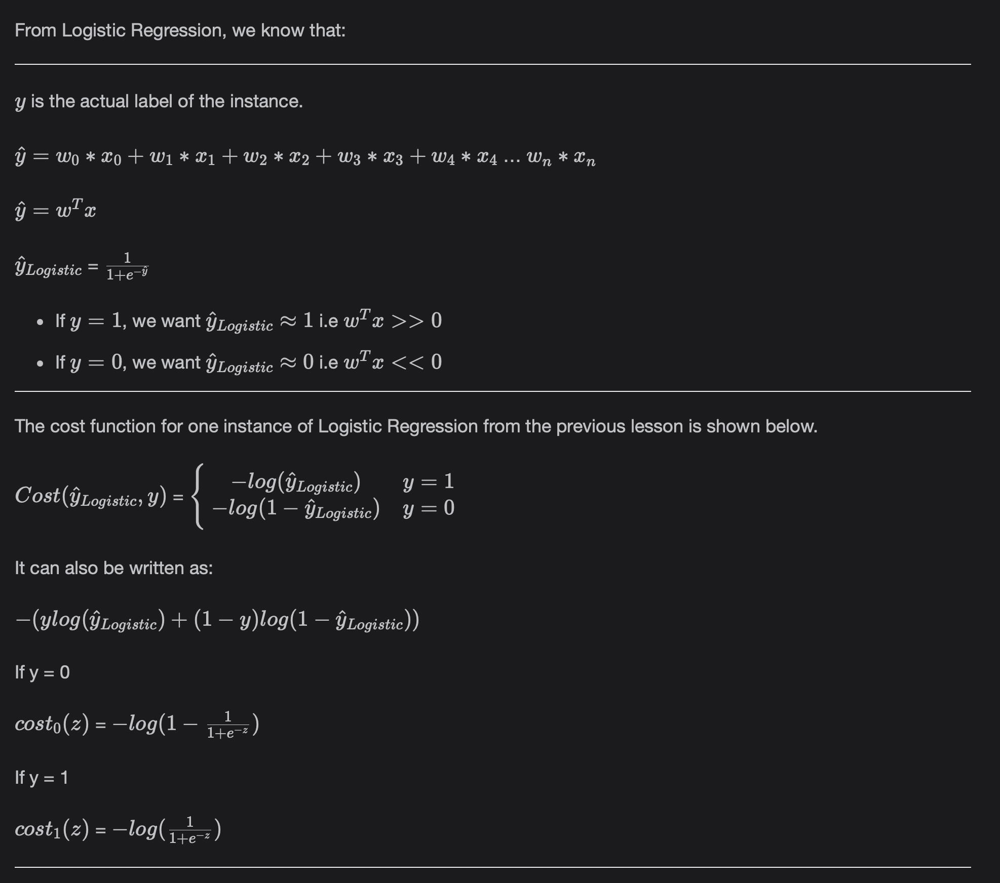

# Support Vector Machines

Learn about Support Vector Machines. It is one of the most widely used classification algorithms and it provides a lot of power when dealing with classification problems.

> We'll cover the following:
>
> - Support Vector Machines
>   - Mathematical intuition
> - Kernel Trick
> - Pros and cons of SVM
>   - Advantages
>   - Disadvantages
> - SVM implementation in Python

## Support Vector Machines

Support Vector Machines are one of the most widely used classification algorithms in Machine Learning. **They are also used for Regression problems, and we have already seen their implementation in the previous lessons.**

- If the data is linearly separable (meaning it need a hyperplane to separate the classes), then the Support Vector Machine (SVM) is simple, and it finds the decision boundary which is the most distant form the points nearest to the said decision boundary from both classes.
- If the data is not linearly separable (non-linear), then **Kernel Trick** is used in SVM, **which involves mapping the feature space in the current dimension to higher dimensions such that they are easily separable using a decision boundary.**  
  One of the benefits of Support Vector Machines is that they work very well in cases with limited datasets.
- Data points closer to the hyperplane that influence the position and orientation of the hyperplane are called **Support vectors.**
- SVM classification is robust to outliers.

#### Mathematical intuition

## Kernel Trick

## Pros and cons of SVM

Scikit Learn's documentation lists the following advantages and disadvantages of Support Vector Machines.

#### Advantages

- They are effective in high dimensional spaces.
- They also are effective in cases where the number of dimensions (n) is greater than the number of samples (m).
- They use a subset of training points in the decision function (called support vectors), so it is also **memory efficient.**
- It is versatile, and provides a list of Kernel Functions to deal with non-linear decision boundaries.

#### Disadvantages

- If the number

## SVM implementation in Python
