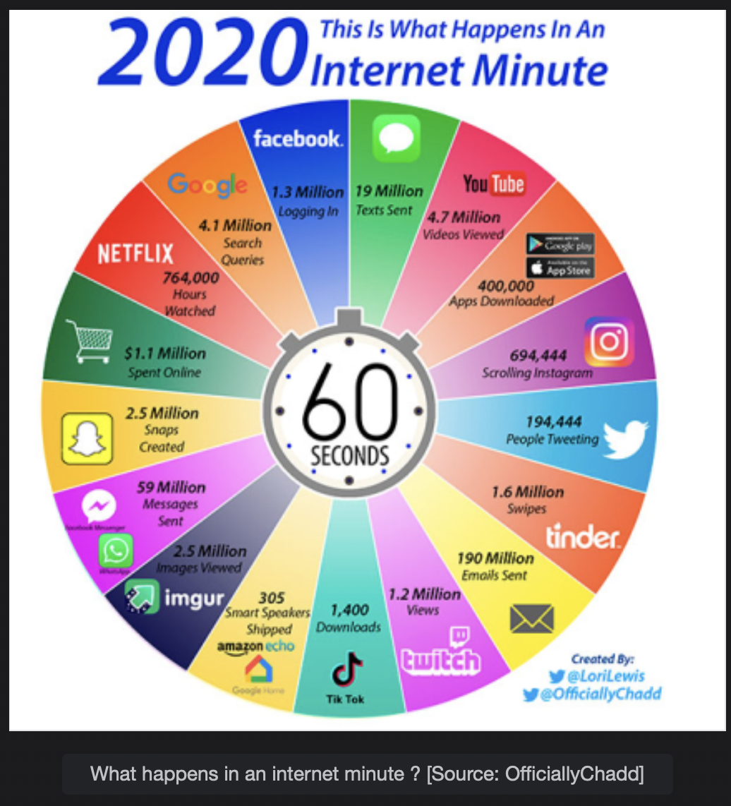
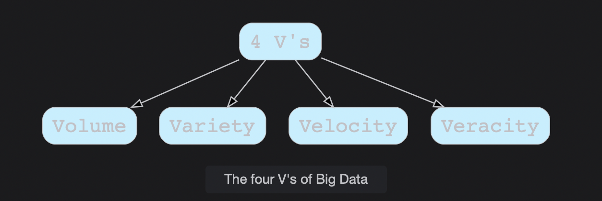

# What is Big Data?

Discover more about Big Data. It refers to the techniques used to extract and analyze information from large datasets that are difficult to process with traditional tools.

> We'll cover the following:
>
> - Big Data
> - Characteristics of Big Data (the 4 V's)
> - Applications of Big Data

## Big Data

Big Data is data with a huge size. It is not possible to analyze data and produce models out of it by using traditional data processing and analyzing techniques.  
 People using Facebook, Instagram, Twitter, and other social media sites generate data every minute.

The following image shows what is happening in a minute on the internet.

Processing this vast amount of data requires a whole new set of tools and technologies. It becomes very crucial for big companies to extract insights from this mighty data to generate a lot of revenue.  
 The tools for mining insights out of huge data are in high demand in the industry.

## Characteristics of Big Data (the 4 V's)

There are the following characteristics of Big Data.

- **Volumn:** The size of Big Data is huge, as you can see from the above diagram. It becomes a challenge in itself to collect, store and process this data in an economical and reliable manner.
- **Variety:** Big data includes a variety of data, which includes structured, unstructured and semi-structured data.
- **Velocity:** Big Data is generated at a lot of speed. From the above diagram, it is clear how much data is being generated in just 1 minute and with how much velocity it is being generated.  
   The speed and flow of data is massive and continuous.
- **Veracity:** This is referred to as the quality of the data. As data is coming from different sources, it is difficult to clean and transform it. There can be many uncertainties in the data in the form of noise, abnormalities, and bias, which all needs to be handled.

## Applications of Big Data

These areas utilize Big Data to draw quick insights and predictive models.

- **Recommendation Engines:** Amazon recommends items to users based on the data of millions of users, which us Big Data. The same applies to Netflix and others.
- **Banking:** Millions of transactions happend daily in banks, and they use big data to detect fraudulent transactions.
- **Transportation:** The transportation industry used Big Data for smart route planning finding the shortest path between two points, managing revenue, and many more.
- **Personalized Healthcare:** Personalized healthcare use Big Data, which allows patients to receive efficient, systematic care unlike ever before.
