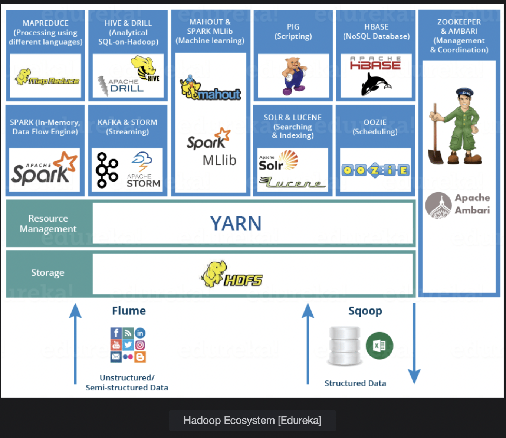

# Hadoop Ecosystem

The Hadoop Ecosystem is a set of tools that helps us solve big data problems.  
 Learn about all the intricacies here.

> We'll cover the following:
>
> - What is Hadoop?
> - Components of Hadoop
>   - Hadoop Distributed File System (HDFS)
>     - Name Node
>     - Data Nodes
>   - YARN (Yet Another Resource Negotiator)
>     - Resource manager
>     - Node Manager
> - Hadoop Ecosystem
>   - Apache Pig, Apache Hive, Apache Mahout, Apache HBase, Apache Drill, Apache Zookeeper, Apache Flume, Apache Sqoop, Apache Solr and Lucene

## What is Hadoop?

Hadoop is an open source software which involves solving big data problems using large clusters of hardware. It efficiently stores and processes big data across big clusters.  
 The idea of Hadoop came from a map reduce paper proposed by Google. Hadoop is developed in the Java programming language.

## Components of Hadoop

While setting up a Hadoop cluster for Big Data processing, there are two services which are mandatory

1. HDFS (Hadoop Distributed File System) for storing data
2. YARN (Yet Another Resource Negotiator) for processing the data in the HDFS

### Hadoop Distributed File System (HDFS)

Hadoop Distributed File System consists of Name Nodes and Data Nodes.

##### Name Node

It is the Master Node which keeps track of all the Data Nodes in the Hadoop Cluser.  
 It records the metadata of the nodes in the clusters like permissions, locations of blocks stored etc.  
 It keeps track of all the partitions of the file in the Data Nodes.

##### Data Nodes

Data Nodes are like slave, which report to a Master Node or Name Node. The actual data is stored on Data Nodes.  
 After processing logic on their part of the data in HDFS, Data Nodes send the result to the Master Node.

### YARN (Yet Another Resource Negotiator)

YARN is responsible for processing data across the Hadoop Distributed File System. YARN consists of two components: **Resource Manager and Node Manager.**

##### Resource manager

It runs on the Master Node. The purpose of the resource manager is to Manage Resources and schedules applications running on top of YARN. Resource manager consists of two more components **Scheduler and Application Manager.**

Scheduler allocated resources to various applications.  
The application manager accepts job submissions and negotiates the first container for executing the application.

##### Node manager

It runs inside Data nodes. It manages resource utilization in each container. It also tracks node health and log management and keeps in contact with the resource manager.

## Hadoop Ecosystem

The above suite of tools and technologies are meant for ingesting, storing and analyzing huge amounts of data, and they fall under the umbrella of the Hadoop Ecosystem.  
 We have discussed about HDFS and YARN.

#### Apache Pig

It was developed by Yahoo. Apache Pig is an abstraction of the Map Reduce Framework.  
 It is a data processing service like SQL (Structured Query Language) which is used to query tables and databases to get important information.

It has its own language called **Pig Latin**, which has the same syntax as SQL.  
It also has a component called **Pig Runtime,** which is an execution environment.

#### Apache Hive

It was created by Facebook. It enables people who are good at using SQL to run queries on large scale datasets in a distributed environment.  
 It has a query language like SQL, which is called **HQL(Hive Query Language).**  
 Hive is highly scalable.

#### Apache Mahout

Mahout provides an environment for building and training machine learning models. We have seen many machine learning models in this Course.  
 It also supports algorithms for Recommender Systems like Content based filtering and collaborative filtering and also for Association Rule Mining.

#### Apache HBase

HBase is a non-relational distributed database. It is a NoSQL database. It is written in JAVA programming language and has its own use cases in the industry.

#### Apache Drill

It provides assistance in processing large amounts of data (Terabytes and Petabytes). It is highly scalable and serves a lot of users with their query requests.

#### Apache Zookeeper

It has responsibility of coordinating with various services running in the distributed environment.  
 It plays a role in synchronization and configuration management.

#### Apache Flume

It helps in the ingestion of unstructured and semi-structured datasets in the Hadoop Distributed file system. It is also valuable for ingesting streaming data like web traffic data, tweets data etc.

#### Apache Sqoop

It has a benefit over Apache Flume as it can also ingest Structured Data.

#### Apache Solr and Lucene

These services fall under the category of Information Retrieval and it provides the facility of searching and indexing in the Hadoop Ecosystem above.
