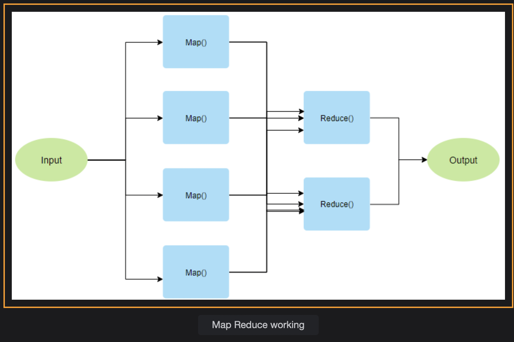
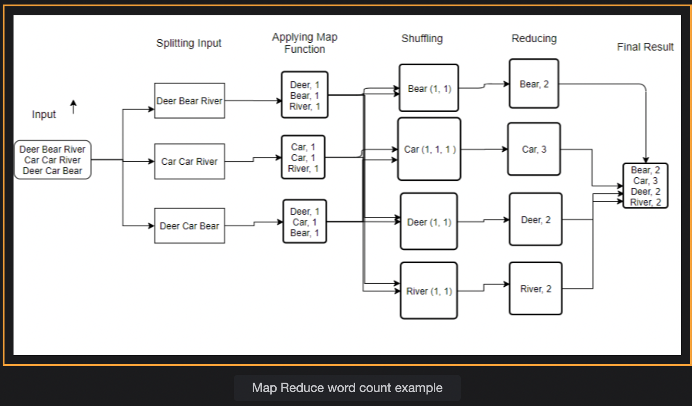

# Map Reduce Framework

Learn about Map Reduce, which is a programming model, and it speeds up processing and computation through distribution.

> We'll cover the follwing:
>
> - Map Reduce
> - Word count example
> - Drawback of Map Reduce

## Map Reduce

This is a programming model introduced by Google. It is part of Hadoop Ecosystem. It enables us to process large datasets in a distributed environment in a distributed and parallel manner.

Map Reduce consists of two tasks, Map and Reduce as it is also visible from the above diagram. Reducer is run after the Map operation has run.

Map operations take in the input, and apply the logic.  
 Then, they produce the output in the form of (Key, Value) pairs.

Next, the reducer receives the (Key, Value) pairs from multiple Map Jobs, as it is also visible from the above diagram.  
 The responsibility of Reducer is to aggregate those intermediate results produced by Mapper functions, and then produce the final output.

## Word count example

> In the above example, we count the occurrence of different words present in a document using the Map-Reduce programming model.
>
> Let's assume we have a document like the one given below. We can have as large a document as we can. The one shown below is only for illustration purposes.
>
> 

We can see that the text is split and passed onto different nodes where the same map function is running. The map function gives the frequency of each word in the respective split.  
 As you can see, we are getting the following (Key, Value) pairs in the first node: (Dear, 1), (Bear, 1), (River, 1).  
 Here, Key is the word, and Value is the count of that word.

In the shuffling, we combine all the (Key, Value) pairs, which have the same Key. We can see that (Beer, 1) appears in two different nodes. In shuffling, we have (Beer, 1, 1), meaning their corresponding count is combined which is spread across different nodes.

In the Reduce operation, we take the sum of the individual counts, which we gather form all the nodes of a single word.  
 For example, (Beer, 1, 1) becomes (Beer, 2).

## Drawback of Map Reduce

- It is not recommended for real time processing.
- It's not always easy to find solutions to the problem using the Map-Reduce Programming model.
- It is not recommended for streaming data. It is best suited for batch processing, meaning cases where you already have a lot of data.
- It is not useful for processing graphs.
