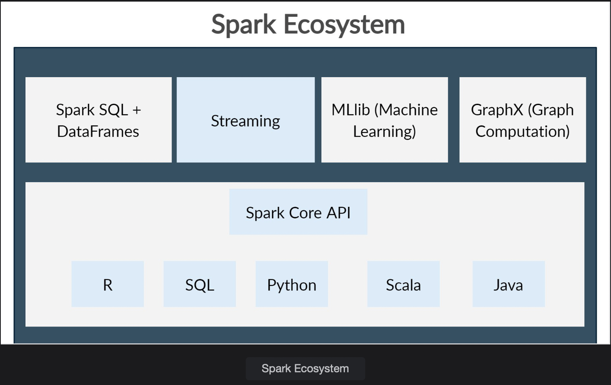
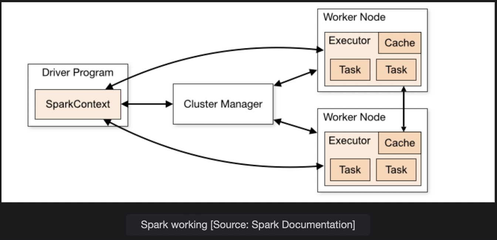
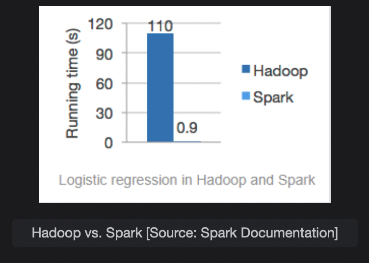

# Apache Spark and it's Components

Learn about Apache Spark. It is part of the Hadoop Ecosystem and is famous for its in-memory processing of data and efficiency.

> We'll cover the following:
>
> - Apache Spark
> - Apache Spark Workloads
> - How Apache Spark Works?
>   - Resilient Distributed Datasets
> - Advantages of Apache Spark

## Apache Spark

Spark was developed in 2019 at the University of California Berkeley. Apache Spark is an open-source and distributed processing system that is used for processing big data. It holds many advantageous over Hadoop and one of them is very fast.  
 It has ability to utilize in-memory caching and query execution to retrieve results to queries in a quick manner.  
 It is well suited for Machine Learing, Graph Analytics, Batch processing, and real-time processing.  
 It provides API's for famous programming languages like Java, Scala, Python, and R.

## Apache Spark Workloads

The Apache Spark framework includes the above mentioned components as shown in the diagram.

- **Spark Core** provides the foundation of the platform. As you can see, APIs are exposed in different languages like R, Python, Scale, etc.
- **Spark SQL** lets us write queries on huge datasets and get their results in a quick and responsive manner.
- **Spark Streaming** is meant for real-time processing of streaming data like visits to websites, tweets data, etc.
- **MLlib** is a library that provides algorithms to apply Machine Learning at scale.
- **GraphX** is a distributed graph processing framework and provides distributed graph algorithms.

## How Apache Spark Works?

- Apache Spark has a **Master/Slave architecture.** We have a Spark Driver or Driver Program which runs on the Master Node and it manages the Cluster Manager.
- **Cluster Manager** is responsible for managing the Slave Nodes and to distribute and monitor execution across the nodes.
- Spark Driver generates the **Spark Context,** which works in conjunction with **Cluster Manager.**
- Spark Driver also generates the **Resilient Distributed Datasets (RDD),** which is the key to Spark’s remarkable speed.
- Spark makes use of Directed Acyclic Graphs to schedule tasks and the orchestration of worker nodes across the cluster.

#### Resilient Distributed Datasets

Resilient Distributed Datasets are distributed among multiple nodes in the cluster and are a key for the fast computation done by Apache Spark.  
 This is an immutable collection of objects.  
 Datasets are loaded in Resilient Distributed Datasets, and Spark performs transformations and actions on RDD’s memory, which automatically speeds things up.  
 Transformations are operations applied to create new RDD’s.  
 Actions just apply computations on the RDD’s and return the results back to Driver Program.

## Advantages of Apache Spark

- **Speed:** It runs workloads one-hundred times faster and is well suited for both Batch and Streaming data.
- **Ease of use:** Spark is easy to use in programming languages like Java, Scala, R, and Python.
- **Runs everywhere:** Spark has the ability to run everywhere like Hadoop, Apache Mesos, and Standalone and it can access diverse data sources.

